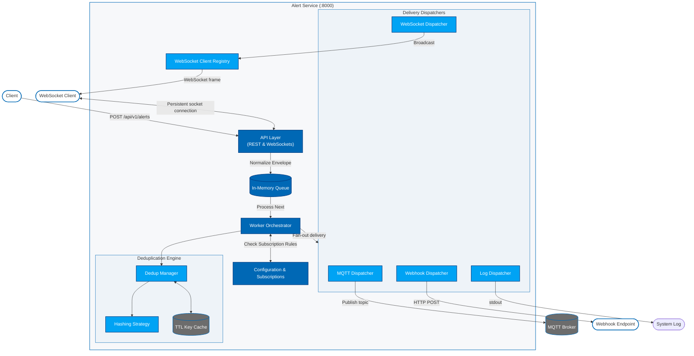

# How It Works

This page describes the architecture and internal request flow of an alert through the microservice.

## Architecture

At a high level, the Alert Service accepts JSON alert payloads via REST, normalizes them, and drops them into an asynchronous processing queue. A background worker loop processes each alert, performs deduplication checking against an in-memory TTL store, and routes unique alerts to all active delivery targets.

**Key components:**

- **API Router** — Accepts JSON payloads, converts them to normalized envelopes, and pushes them to the in-memory queue. Also accepts WebSocket client connections.
- **AlertWorker Loop** — An async loop running in the background. It dequeues envelopes, resolves the subscription rules, evaluates deduplication, and coordinates delivery.
- **Deduplication Engine** — Orchestrates the lookup and hash generation. Uses `FieldHashStrategy` to build a unique key and `MemoryStore` to verify if the key was seen recently.
- **MemoryStore** — A thread-safe, in-memory store that tracks active deduplication keys alongside their monotonic expiry timestamps.
- **Delivery Handlers** — Pluggable interfaces (`log`, `mqtt`, `webhook`, `websocket`) implementing targeted actions.
- **ConnectionManager** — Keeps track of connected WebSocket clients and handles active socket broadcast cleanups.

## Request Flow

1. **Ingest** — A client submits a JSON alert payload to `POST /api/v1/alerts`.
2. **Enqueue** — The API layer wraps the raw payload into a normalized `AlertEnvelope` model containing:
   - `alert_type`
   - `metadata`
   - `timestamp`
   - `payload` (the raw payload dict)
   
   The envelope is pushed into the `asyncio.Queue` and a `{"status": "accepted"}` response is immediately returned to the caller.
3. **Dequeue & Match** — The background worker dequeues the envelope and checks the config (`AppConfig`) for a subscription matching `alert_type`. If no matching subscription exists, the alert is dropped.
4. **Deduplication Check** — If deduplication is enabled for the matched subscription, the worker evaluates it:
   - The field-hash strategy extracts the configured JSON dot-notation field values (e.g. `metadata.poi_id`).
   - The fields are concatenated and hashed (SHA-1 or MD5).
   - If the hash exists in `MemoryStore` and is not expired, the alert is logged as a duplicate and dropped.
   - If it is new, the key is written to `MemoryStore` with `window_seconds` TTL, and processing proceeds.
5. **Fan-out Delivery** — The worker dispatches the alert envelope to each registered target in the subscription's `delivery` list.
6. **Retry Loop** — If a delivery handler raises an exception, the worker runs an independent retry loop for that target, attempting delivery up to `retry_attempts` times and waiting `retry_interval_seconds` between tries. A failure in one handler (e.g. Webhook down) does not block or cancel delivery to other targets (e.g. MQTT and Log).

## Configuration Surface

All runtime settings are parsed and validated via a configuration pipeline. Default variables can be overridden at runtime using environment variables. See the [Configuration Guide](./get-started/configuration.md) for a comprehensive list of parameters.
