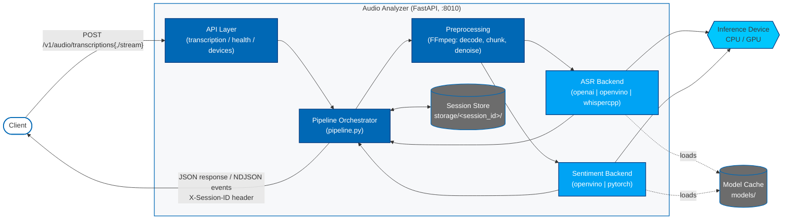

# How It Works

This page describes the architecture and internal flow of an audio request
through the microservice.

## Architecture

At a high level, the Audio Analyzer is a FastAPI service that accepts an
audio upload, splits it into chunks with FFmpeg, runs each chunk through an
ASR backend, and (optionally) runs a sentiment model in parallel. Results
are aggregated per session and returned either as a single JSON response or
as an NDJSON event stream.

**Key planes:**

- **API layer** — request validation, session header handling, response
  shaping (single JSON vs. streaming NDJSON).
- **Pipeline orchestrator** — drives preprocessing, ASR, and sentiment;
  aggregates per-chunk results into a session-level summary.
- **Backends** — pluggable ASR and sentiment implementations selected via
  config; each backend handles its own model loading and device placement.
- **Session store** — per-session directory holding chunk files and
  metadata; enables multi-upload continuation via `session_id`.

## Request Flow

1. **Upload** — A client sends an audio file to either
   `POST /v1/audio/transcriptions` (single response) or
   `POST /v1/audio/transcriptions/stream` (NDJSON event stream).
2. **Session resolution** — If `session_id` is supplied, the service reuses
   the existing session directory under `storage/<session_id>/`. Otherwise, it
   creates a new session and returns the id in the `X-Session-ID` response
   header.
3. **Preprocessing** — FFmpeg decodes the upload and produces audio chunks
   under the configured `audio_preprocessing.chunk_dir`. Chunk size, silence
   detection, and optional denoising are controlled by the
   `audio_preprocessing` config section.
4. **ASR inference** — Each chunk is transcribed by the configured ASR
   backend (`openai`, `openvino`, or `whispercpp`) on the configured device
   (typically `CPU`; `GPU` is available only for supported OpenVINO paths).
5. **Sentiment (optional)** — When `sentiment.enabled` is true, the
   service runs the configured sentiment model (`openvino` or `pytorch`) and
   aggregates a session-level summary.
6. **Response** — The non-streaming endpoint returns a final response object;
   the streaming endpoint emits `transcription.chunk` events as each chunk
   completes and a final `transcription.completed` event.
7. **Cleanup** — If `pipeline.delete_chunks_after_use` is true, temporary
   chunk files are removed after processing. Session metadata remains under
   `storage/<session_id>/`.

## Components

- `api/` — FastAPI routers for transcription, health, and device listing.
- `pipeline.py` — Orchestrates preprocessing, ASR, and sentiment.
- `components/` — Backend implementations for ASR and sentiment providers.
- `utils/` — Audio utilities, config loading, and session helpers.
- `dto/` — Request and response data models.

## Configuration Surface

All runtime behavior is driven by `config.yaml`, shared by both standalone
and container runs, with targeted overrides via `AUDIO_ANALYZER__...`
environment variables. See the [Configuration Guide](./get-started/configuration.md) for the
full list of fields.
