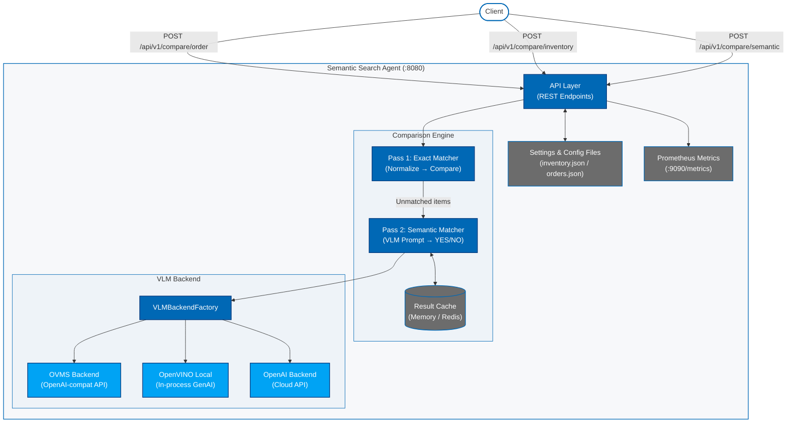

# How It Works

This page describes the architecture and internal request flow of a comparison request through the microservice.

## Architecture

At a high level, the Semantic Search Agent accepts item comparison payloads via REST, passes them through a configured matching strategy, and returns structured results. The matching pipeline uses a two-pass approach — fast exact normalization first, followed by VLM-based semantic reasoning for any remaining unmatched items — to minimize latency and inference costs.

**Key components:**

- **API Router** — Accepts and validates incoming comparison requests using Pydantic models. Routes to the appropriate ComparisonEngine method and returns structured JSON responses.
- **ComparisonEngine** — Orchestrates the two-pass matching pipeline. Loads order and inventory data from config JSON files. Coordinates exact and semantic matchers, aggregates results (missing, extra, quantity mismatch, matched), and records Prometheus metrics.
- **ExactMatcher** — Normalizes both input strings (lowercase, whitespace trimming, special character removal) and performs direct string equality. Returns confidence `1.0` on match, `0.0` otherwise.
- **SemanticMatcher** — Constructs a structured prompt from the input pair and a context string, submits it to the configured VLM backend, and interprets the YES/NO response as a boolean match. Checks an in-memory or Redis cache before invoking the VLM to avoid redundant inference calls.
- **HybridMatcher** — Runs ExactMatcher first as a fast path. If the exact confidence meets the configured threshold (default `0.9`), returns the exact result immediately. Otherwise, delegates to SemanticMatcher and returns the semantic result.
- **VLMBackendFactory** — Singleton factory that creates and caches one VLM backend instance per backend type. Supports `ovms`, `openvino_local`, and `openai` backends.
- **OVMS Backend** — Sends requests to an OpenVINO Model Server using the OpenAI-compatible `/v3/chat/completions` endpoint. Bypasses system proxy to communicate with internal OVMS hosts.
- **OpenVINO Local Backend** — Loads an OpenVINO IR model in-process using the `openvino-genai` library. Suitable for GPU-accelerated edge deployments without a separate model server.
- **OpenAI Backend** — Delegates to the OpenAI API for cloud-based inference. Used as a development or fallback option.
- **Cache** — Keyed by MD5 hash of the normalized input pair and context string. Supports configurable TTL. Backed by either an in-process `MemoryCache` or an external `RedisCache`.

## Request Flow

### Order Validation (`POST /api/v1/compare/order`)

1. **Validate** — FastAPI validates the request body against `OrderValidationRequest`. Each item must have a `name` (string) and `quantity` (integer ≥ 1).
2. **Pass 1 — Exact Matching** — For every expected item, the engine normalizes its name and searches detected items for an exact normalized match. On a match, the item is added to `matched` and the detected slot is reserved. If quantities differ, the item is added to `quantity_mismatch`.
3. **Pass 2 — Semantic Matching** — For each expected item still unmatched after Pass 1, the engine iterates over unreserved detected items and calls `matcher.match(expected_name, detected_name)`. If `MatchResult.match` is `True`, the item pair is added to `matched` with the semantic confidence. Unmatched expected items become `missing`; unreserved detected items become `extra`.
4. **Respond** — Returns a `OrderValidationResponse` containing `status` (`validated` or `mismatch`), a full `validation` breakdown, and `metrics` (exact/semantic match counts, processing time).

### Inventory Validation (`POST /api/v1/compare/inventory`)

1. **Validate** — FastAPI validates the request body against `InventoryValidationRequest`. Accepts a list of item name strings and an optional inventory list (uses `config/inventory.json` if omitted).
2. **Per-Item Matching** — For each input item, exact match is attempted against all inventory entries. If no exact match is found and semantic matching is enabled, the engine iterates inventory entries and picks the highest-confidence semantic match above the threshold.
3. **Respond** — Returns `InventoryValidationResponse` with per-item results (matched item, match type, confidence) and a summary (total, matched, unmatched, processing time ms).

### Semantic Match (`POST /api/v1/compare/semantic`)

1. **Validate** — FastAPI validates the request body against `SemanticMatchRequest` with `text1`, `text2`, and an optional `context` string.
2. **Match** — Directly calls `SemanticMatcher.match()`, which checks the cache first, then invokes the VLM backend with a structured prompt.
3. **Respond** — Returns `SemanticMatchResponse` with `match` (boolean), `confidence` (float), `reasoning` (VLM response), and `match_type`.

## Configuration Surface

All runtime settings are parsed and validated via Pydantic Settings on startup. Environment variables or a `.env` file at the project root override defaults. See the [Configuration Guide](./get-started/configuration.md) for a comprehensive list of parameters.
