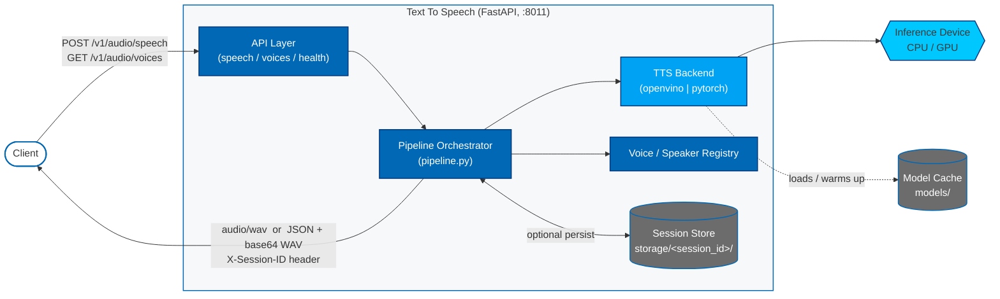

# How It Works

This page describes the architecture and internal flow of a TTS request
through the microservice.

## Architecture

At a high level, the Text To Speech service is a FastAPI application that
accepts a JSON request, runs it through a runtime-backed TTS pipeline
(OpenVINO or PyTorch), and returns either raw WAV audio or a JSON envelope
containing metadata and a base64-encoded WAV payload. Models are loaded and
warmed up once per process and reused across requests.

**Key planes:**

- **API layer** — request validation, language/voice resolution, and
  response shaping (raw `audio/wav` vs. JSON envelope).
- **Pipeline orchestrator** — owns model load/warmup, speaker resolution,
  synthesis, and optional persistence.
- **TTS backend** — pluggable OpenVINO or PyTorch runtime selected via
  config; handles model placement on the configured device and precision.
- **Voice registry** — exposes the available speakers/voices for the
  active model and resolves the request's `voice` field.
- **Session store** — when `pipeline.persist_outputs` is true, the
  synthesized WAV and metadata are written under `storage/<session_id>/`.

## Request Flow

1. **Request** — A client sends a JSON body to `POST /v1/audio/speech` with
   the text to synthesize and an optional `voice`, `language`,
   `instructions`, and `response_format`.
2. **Validation** — The service validates the request, enforces the English
   language constraint, and resolves the speaker against the configured
   voices.
3. **Model load / warmup** — On first use, the configured TTS model is
   loaded according to `models.tts.runtime` (`openvino` or `pytorch`) on the
   configured `device` (`CPU` or `GPU`) and `dtype`. Subsequent
   requests reuse the warmed-up pipeline.
4. **Synthesis** — The pipeline generates a WAV waveform from the input
   text using the chosen model and speaker embedding.
5. **Response** — When `response_format=wav`, the service returns raw
   `audio/wav` with `X-Session-ID` in the response header. When
   `response_format=json`, it returns metadata plus a base64-encoded WAV
   payload.
6. **Persistence (optional)** — If `pipeline.persist_outputs` is true, the
   WAV and metadata are also written to `storage/<session_id>/`.

## Components

- `api/` — FastAPI routers for speech generation, voice metadata, and
  health.
- `pipeline.py` — Orchestrates model loading, warmup, and synthesis.
- `components/` — Backend implementations for the OpenVINO and PyTorch TTS
  runtimes.
- `utils/` — Audio utilities, config loading, and session helpers.
- `dto/` — Request and response data models.

## Configuration Surface

All runtime behavior is driven by `config.yaml`, shared by both standalone
and container runs, with targeted overrides via `TEXT_TO_SPEECH__...`
environment variables. See [Configuration Guide](./get-started/configuration.md) for the
full list of fields.
