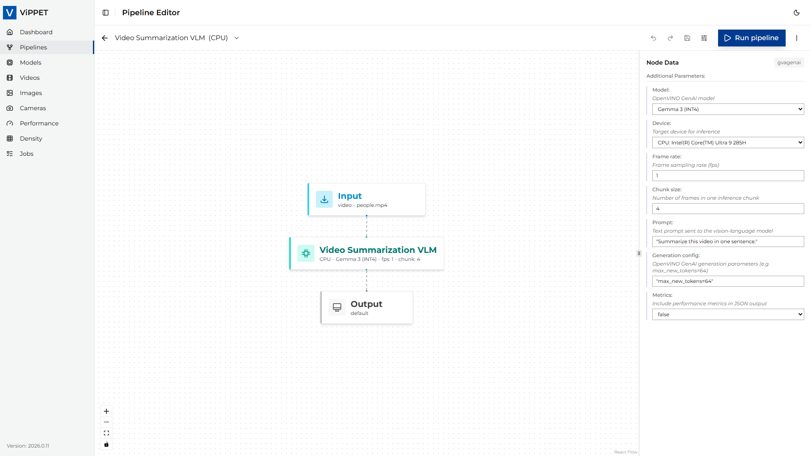
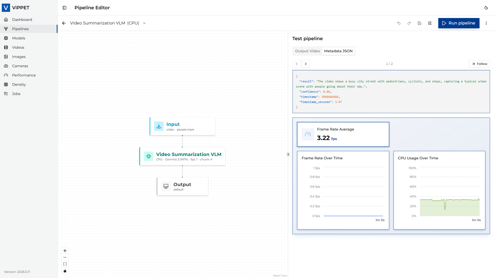

# GenAI Use Case

This guide walks you through the **Video Summarization VLM** predefined pipeline. It uses the `gvagenai`
DL Streamer element together with a vision-language model (VLM) to generate concise, scene-level natural-language
summaries from sampled frames of an input video. Unlike the classic detection/classification pipelines, this
pipeline produces *metadata-only* output (JSON Lines) — there is no rendered output video.

## Step 1. Navigate to the predefined pipeline

1. Open the ViPPET UI and go to the **Pipelines** view from the left navigation.
2. Locate the **Video Summarization VLM** tile in the pipeline grid. It is identifiable by its
   **GenAi** tag badge shown on the card.
3. Click the tile (or one of its variant badges) to open it in the **Pipeline Builder**.

The pipeline ships with two variants — **CPU** and **GPU** — both pre-configured with the same
OpenVINO™ model. They differ only in the target inference device and in the corresponding pre-converted
OpenVINO™ model directory path used for that variant. Select the variant matching the hardware you want to benchmark.

> **Note:** `gvagenai` runs the model through OpenVINO™, which does not yet support vision-language models on
> NPU (only text and speech). NPU variants will be added if OpenVINO™ adds VLM-on-NPU support in the future.

## Step 2. Configure the GVAGenAI element

In the Pipeline Builder, click the **gvagenai** node to open its configuration panel.

The following parameters are exposed in the UI (defaults shown reflect the predefined pipeline):

| Parameter             | Default                                   | Description                                                                                                                                                                                                |
| --------------------- | ----------------------------------------- | ---------------------------------------------------------------------------------------------------------------------------------------------------------------------------------------------------------- |
| **model**             | `google/gemma-3-4b-it` (INT4)             | The vision-language model used for summarization. Only models on disk tagged for GenAI are listed. The on-disk path is resolved automatically from the selected variant (CPU/GPU).                         |
| **device**            | `CPU` / `GPU`                             | Target inference device. Set automatically by the selected variant; use the variant switcher to change devices rather than editing this field directly.                                                    |
| **prompt**            | `"Summarize this video in one sentence."` | Instruction sent to the VLM for each chunk of sampled frames. Edit it to control the style, length, or focus of the generated summaries (for example, *"List the main activities visible in the scene."*). |
| **generation-config** | `max_new_tokens=64`                       | Generation-config controls for the VLM, expressed as a comma-separated `key=value` list (e.g., `max_new_tokens=128,temperature=0.7`). Larger values produce longer summaries at the cost of latency.        |
| **frame-rate**        | `1`                                       | Number of frames per second sampled from the decoded video and fed to the VLM. Lower values reduce compute; higher values capture more temporal detail.                                                    |
| **chunk-size**        | `4`                                       | Number of sampled frames grouped into a single VLM inference call. One summary entry is emitted per chunk.                                                                                                 |
| **metrics**           | `false`                                   | When `true`, the element emits per-inference timing metrics alongside the summary metadata.                                                                                                                |

The downstream `gvametapublish` and `gvafpscounter` nodes are
responsible for writing the JSON Lines output and reporting FPS, respectively.

> **Note:** The Video Summarization VLM pipeline is *metadata-only* — it terminates in an unnamed `fakesink`
> and does not produce a rendered output video. The **Save to file** and **Live stream** output modes
> therefore have no effect for this pipeline; only the JSON Lines metadata file is generated.

## Step 3. Run the pipeline

1. Confirm that the input video is available under the shared `videos/input/` directory (the default pipeline
   uses `people.mp4`).
2. Click **Run**. ViPPET launches the pipeline as a job; you can follow progress in the **Jobs** view.
3. While the job runs, the selected device's utilization (CPU/GPU/NPU) should increase visibly in the
   **Dashboard**.

## Step 4. Interpret the results

When the job completes, two outputs are available:

- **Scene summaries (JSON Lines):** the VLM writes one record per processed chunk to
  `videos/output/summary.jsonl` in the shared volume. Each line is a JSON object whose `summary` (or
  equivalent) field contains the generated text for that chunk, together with frame/timestamp information.

- **Throughput (FPS):** the `gvafpscounter` element reports the steady-state processing rate after a short
  warm-up (the first 10 frames are skipped via `starting-frame=10`). The number is visible in the job logs
  and in the **Performance** results view.

To evaluate the pipeline across hardware, re-run it with a different variant selected and compare the
reported FPS and generated summaries.
