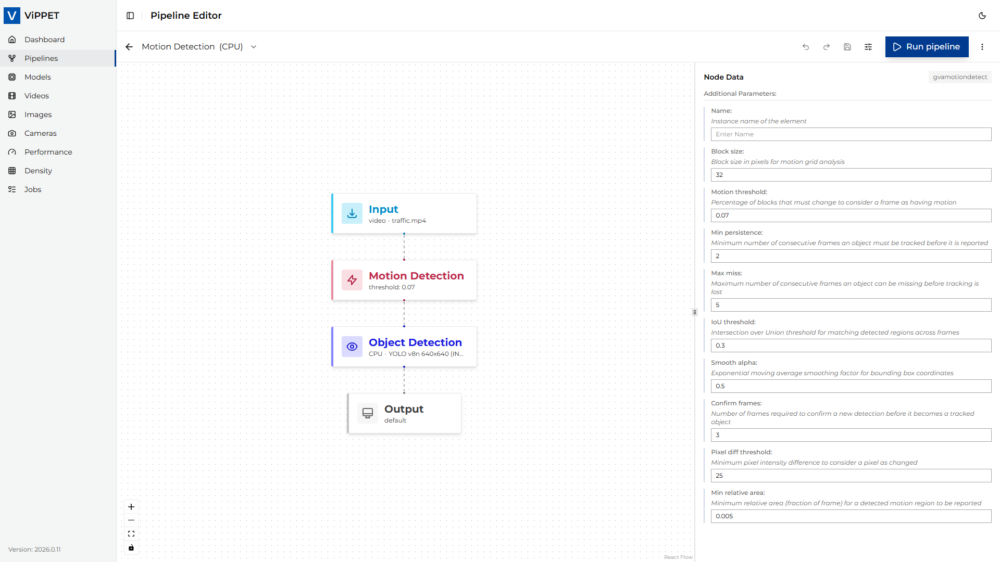
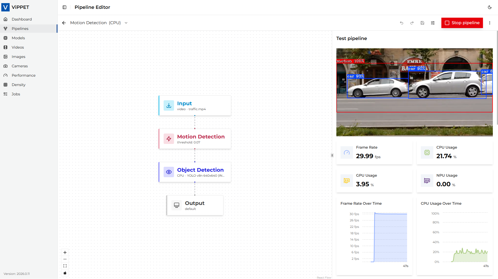

# Motion Detection Use Case

This guide walks you through the **Motion Detection** predefined pipeline. It uses the `gvamotiondetect`
DL Streamer element to identify regions of motion in each frame and then runs YOLOv8n object detection
through `gvadetect`, restricted to those motion regions of interest (ROIs). The result is an efficient
"detect only where something is moving" workload that is well suited to fixed-camera scenes such as
traffic monitoring, parking lots, or any other smart-city setup with mostly static backgrounds.

## When to use motion detection

The Motion Detection pipeline is a good fit when:

- The camera is static and most of the frame is background most of the time.
- You only care about activity (vehicles, people, animals) and not about identifying static objects.
- You want to reduce the cost of full-frame inference by skipping idle frames or limiting detection
  to small motion ROIs.

It is **not** a good fit for handheld or moving cameras, scenes with constant global motion (for
example heavy foliage or rain), or workloads that require recognizing static objects.

## Step 1. Navigate to the predefined pipeline

1. Open the ViPPET UI and go to the **Pipelines** view from the left navigation.
2. Locate the **Motion Detection** tile in the pipeline grid. It is identifiable by its
   **Smart Cities** tag badge shown on the card.
3. Click the tile (or one of its variant badges) to open it in the **Pipeline Builder**.

The pipeline ships with three variants - **CPU**, **GPU**, and **NPU** - all using the same YOLOv8n
INT8 OpenVINO™ model. They differ only in the target inference device and in the pre-processing backend
used for that variant. Select the variant matching the hardware you want to benchmark.

## Step 2. Configure the Motion Detection element

In the Pipeline Builder, click the **Motion Detection** node to open its configuration panel.



The following parameters are exposed in the UI:

| Parameter                | Default (UI) | Description                                                                                                                                                              |
|--------------------------|--------------|--------------------------------------------------------------------------------------------------------------------------------------------------------------------------|
| **name**                 | (empty)      | Instance name of the element. Optional, useful for logs and debugging.                                                                                                   |
| **block-size**           | `32`         | Block size in pixels for the motion grid analysis. Smaller blocks detect finer motion at higher cost; larger blocks are cheaper but coarser.                             |
| **motion-threshold**     | `5.0`        | Percentage of blocks that must change between two consecutive frames for the frame to be considered as containing motion. Lower values make the detector more sensitive. |
| **min-persistence**      | `5`          | Minimum number of consecutive frames an object must be tracked before it is reported as a motion ROI. Higher values reduce false positives caused by short-lived noise.  |
| **max-miss**             | `5`          | Maximum number of consecutive frames an object can be missing before tracking is lost. Higher values keep tracks alive through brief occlusions.                         |
| **iou-threshold**        | `0.3`        | Intersection over Union threshold used to match motion regions between frames. Lower values allow looser matching across frames.                                         |
| **smooth-alpha**         | `0.5`        | Exponential moving average smoothing factor for the bounding boxes. Higher values follow new positions faster; lower values produce smoother, slower-moving boxes.       |
| **confirm-frames**       | `3`          | Number of frames required to confirm a new detection before it becomes a tracked object. Higher values reduce flicker but delay reporting.                               |
| **pixel-diff-threshold** | `25`         | Minimum per-pixel intensity difference (0-255) for a pixel to count as changed when comparing consecutive frames.                                                        |
| **min-rel-area**         | `0.005`      | Minimum relative area (fraction of the full frame) for a detected motion region to be reported. Filters out very small specks of motion.                                 |

> **Note:** The defaults shown above are the UI defaults applied when you place a fresh
> `gvamotiondetect` node on the canvas. The predefined **Motion Detection** pipeline overrides two of
> them in its variants: `motion-threshold=0.07` and `min-persistence=2`, which makes the detector
> noticeably more sensitive than the bare UI defaults. Edit these values in the panel to match your
> scene and noise level.

The downstream `gvadetect` node runs YOLOv8n object detection with `inference-region=roi-list`, so it
only inspects the motion ROIs produced by `gvamotiondetect` rather than the whole frame. The
`gvametapublish` node writes detections as JSON Lines, `gvafpscounter` reports throughput after a
short warm-up, and `gvawatermark` draws the boxes on the output video.

## Step 3. Run the pipeline

1. Confirm that the input video is available under the shared `videos/input/` directory. The default
   pipeline uses `traffic.mp4`. If you do not have a traffic-like video on hand, upload one through
   the **Videos** view in the UI - any clip from a static CCTV camera (cars, people, bikes) will work
   well. Files uploaded through the UI land in `videos/input/uploaded/` and can then be selected as
   the source.
2. Click **Run**. ViPPET launches the pipeline as a job; you can follow progress in the **Jobs** view.
3. While the job runs, the selected device's utilization (CPU/GPU/NPU) should increase visibly in the
   **Dashboard**.

## Step 4. Interpret the results



When the job completes (or while it is still running), three outputs are available:

- **Detections (JSON Lines):** the `gvametapublish` element emits one JSON record per inferred frame.
  In the predefined pipeline the records are sent to `/dev/null` so the variants stay lean for
  benchmarking. To capture them on disk, edit the variant and change `file-path=/dev/null` to a path
  inside the shared `videos/output/` directory (for example `file-path=/videos/output/motion.jsonl`).
- **Annotated video:** the `gvawatermark` element overlays the YOLOv8n detection boxes on the
  decoded frames. Switch the variant's output mode to **Save to file** or **Live stream** to consume
  it; the default mode in the predefined pipeline terminates in `fakesink` and discards the frames
  after watermarking.
- **Throughput (FPS):** the `gvafpscounter` element reports the steady-state processing rate after a
  short warm-up (the first 100 frames are skipped via `starting-frame=100`). The number is visible
  in the job logs and in the **Performance** results view.

To evaluate the pipeline across hardware, re-run it with a different variant selected and compare
the reported FPS and detection quality.

## Step 5. Consume the live metadata stream

For workloads that need to react to detections in real time (for example forwarding events to a
downstream system), ViPPET exposes the metadata produced by `gvametapublish` as a live
Server-Sent Events (SSE) stream.

1. Start the pipeline as a **performance test** so that the job is tracked by the Tests subsystem.
2. Make sure the `gvametapublish` element writes to a real file path (see Step 4); SSE streaming is
   not available when the pipeline writes to `/dev/null`.
3. Poll the performance job status and read the `metadata_stream_urls` field of the response. It is
   a mapping from pipeline id to a list of SSE URLs - one URL per `gvametapublish` file in the
   pipeline. The list is `null` when no streamable metadata file is present.
4. Open the URL with any SSE-capable client. Each `data:` event carries one JSON Lines record
   produced by `gvametapublish`. The connection stays open while the pipeline runs, sends a
   `: keepalive` comment every 30 s, and closes automatically when the pipeline finishes.

The SSE endpoint is shaped as:

```text
GET /api/v1/tests/performance/{job_id}/metadata/{pipeline_id}/{file_index}/stream
Accept: text/event-stream
```

A historical snapshot of recent records is also available without opening an SSE stream:

```text
GET /api/v1/tests/performance/{job_id}/metadata/{pipeline_id}/{file_index}
```

Both endpoints, together with their request and response schemas, are documented in the live
OpenAPI reference at `/docs` (Swagger UI) and `/redoc`.

## Tips and troubleshooting

- **Too many or too few ROIs.** Tune `motion-threshold` (sensitivity) and `min-rel-area` (minimum
  size) first. `confirm-frames` and `min-persistence` help when short bursts of noise are leaking
  through.
- **Boxes jitter.** Raise `smooth-alpha` toward `0.7-0.9` for steadier boxes, at the cost of slower
  reaction to fast-moving objects.
- **Tracks split or flicker.** Lower `iou-threshold` to allow looser frame-to-frame matching, and
  raise `max-miss` to keep tracks alive through brief occlusions.
- **No detections at all.** Check that the input video actually contains motion (a static scene will
  legitimately produce zero motion ROIs and therefore zero YOLOv8n detections), and that the
  YOLOv8n INT8 model is installed under `/models/output/public/yolov8n/INT8/`.
- **`gvamotiondetect` fails to link on GPU.** The element only accepts NV12 frames; ViPPET's graph
  validator injects the required conversion automatically, but custom pipelines that bypass it must
  insert `videoconvert ! video/x-raw,format=NV12` (CPU) or a `vapostproc`-based equivalent (GPU)
  before the element.
