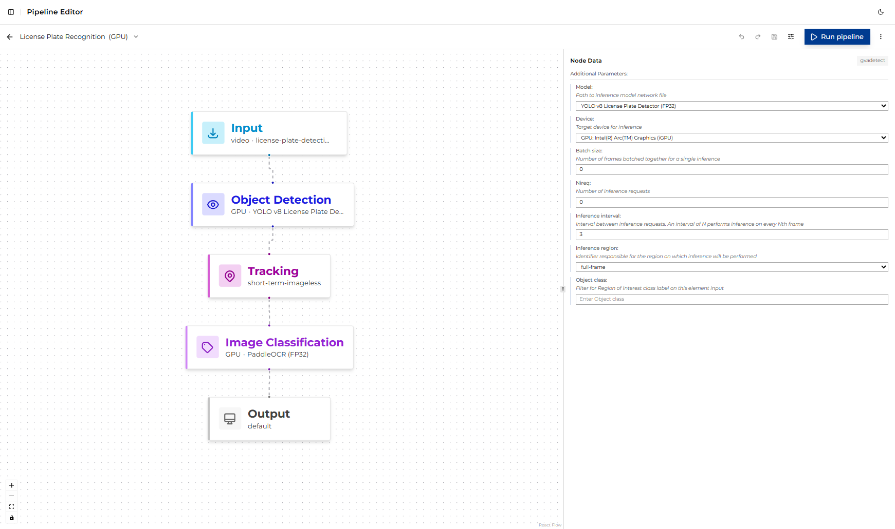
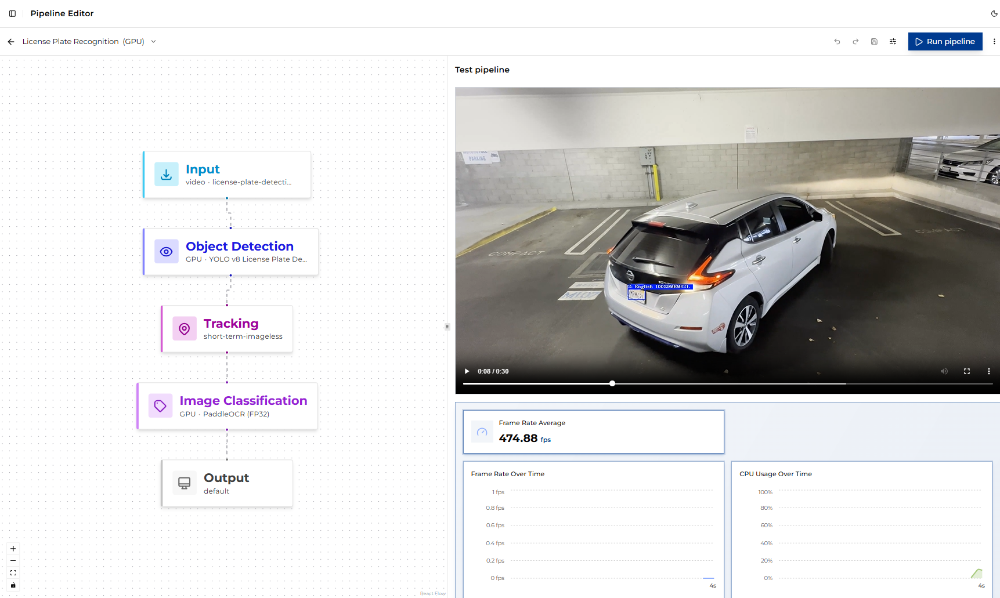

# Vision Use Case

The application is served with several predefined pipelines that cover different vision use cases:

- **License Plate Recognition** - A solution that supports license plate recognition, vehicle detection
  with attribute classification, and other object detection and classification tasks, adaptable based
  on the selected model.
- **Smart Parking** - A cloud-native, microservices-based video analytics pipeline that uses
  pre-trained deep learning models to detect parking-space occupancy.
- **Smart VNR** - Processes video streams with AI-based analytics, including object detection,
  tracking, and classification. Outputs include video recording, metadata, and processed video frames.
- **Motion Detection** - Identifies regions of motion, then runs object detection restricted to those
  motion ROIs.
- **Goods Detection** - Uses object detection to identify various retail-related objects, making it
  suitable for inventory management, customer behavior analysis, and other retail use cases.
- **Defect Detection** - Uses machine vision for automatic pallet defect detection, enabling efficient
  quality control in manufacturing.
- **Age and Gender Recognition** - Detects faces and predicts age groups and gender, making it suitable
  for customer demographics analysis and other retail use cases.

Vision pipelines are constructed using *Object Detection* and *Object Classification* blocks.
Both are supplied with models to perform their respective tasks.

## Step 1. Navigate to the predefined pipeline

1. Open the ViPPET UI and go to the **Pipelines** view from the left navigation.
2. Locate the **License Plate Recognition** tile in the pipeline grid.
3. Click the tile (or one of its variant badges) to open it in the **Pipeline Builder**.

The pipeline ships with three variants — **CPU**, **GPU**, and **NPU** — all pre-configured with the same
model. They differ only in the target inference device.
Select the variant matching the hardware you want to benchmark.

## Step 2. Configure the vision element

In the Pipeline Builder, click the **Object Detection** node to open its configuration panel.

The following parameters are exposed in the UI (defaults shown reflect the predefined pipeline):

| Parameter              | Default                                 | Description                                                                                                                                             |
|------------------------|-----------------------------------------|---------------------------------------------------------------------------------------------------------------------------------------------------------|
| **model**              | `YOLO v8 License Plate Detector` (FP32) | Model used by the element for inference. Choose a model compatible with the selected element type and target device to balance accuracy and throughput. |
| **device**             | `CPU` / `GPU` / `NPU`                   | Target inference device. Set automatically by the selected variant; use the variant switcher to change devices rather than editing this field directly. |
| **batch size**         | `0`                                     | Number of frames batched together for a single inference.                                                                                               |
| **nireq**              | `0`                                     | Number of inference requests.                                                                                                                           |
| **inference interval** | `3`                                     | Interval between inference requests. An interval of N performs inference on every Nth frame.                                                            |
| **inference region**   | `full-frame`                            | Identifier responsible for the region on which inference will be performed.                                                                             |
| **object class**       | *(empty)*                               | Filter for the Region of Interest class label on this element input. Leave empty to process all classes.                                                |

Next, click **Image Classification**. It exposes the same parameters shown in the table above.

The default model for the classification block is `ResNet-18 ImageNet` (FP32), which performs
general-purpose image classification. You can switch to a different model if you want to evaluate
how model selection impacts performance across different hardware.

The **inference region** is set to `roi-list`.

## Step 3. Run the pipeline

1. Confirm that the input video is available under the shared `videos/input/` directory (the default pipeline
   uses `license-plate-detection.mp4`).
2. Click **Run**. ViPPET launches the pipeline as a job; you can follow progress in the **Jobs** view.
3. While the job runs, the selected device's utilization (CPU/GPU/NPU) should increase visibly in the
   **Dashboard**.

## Step 4. Interpret the results

When the job completes, several outputs are available:

- **Output Video**: the processed video with overlaid detections and classifications.
- **Average Frame Rate (FPS)**: Reported in the job details and visible on the Dashboard. This is
  the most important metric for comparing performance across hardware targets.
- **Inference Metrics**: Several charts show utilization indicators, including CPU, GPU, NPU,
  memory usage, temperature, and power.

To evaluate the pipeline across hardware, re-run it with a different variant selected and compare the
reported FPS and generated summaries.
