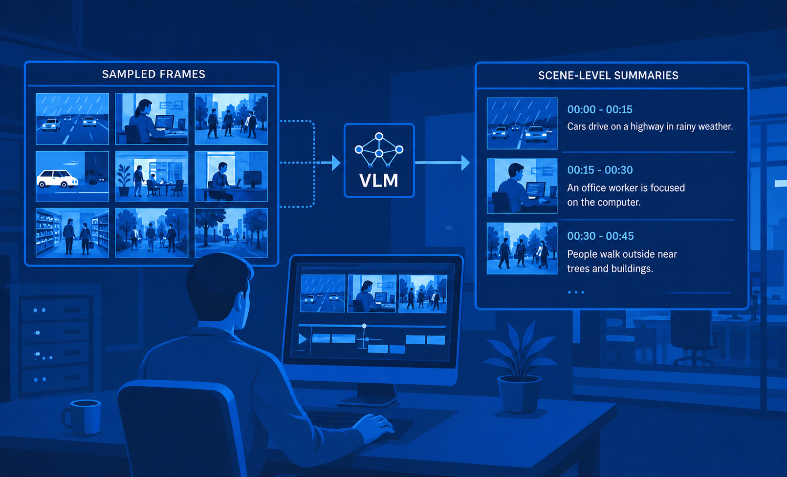
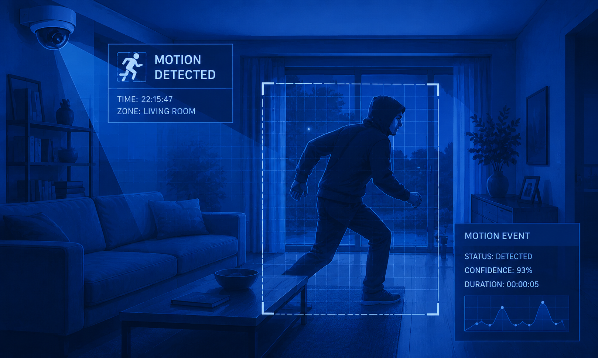
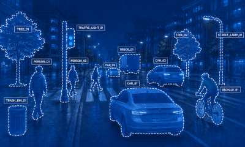

# ViPPET 2026.1

## Major features and improvements

- [New predefined pipelines](#new-predefined-pipelines) - New pipelines for showcasing Video
  Summarization, Motion Detection, Instance Segmentation and Pose Estimation
- [Pipeline Latency Reporting](#pipeline-latency-reporting) - Added support for reporting latency
  metrics to show end-to-end pipeline processing time
- [NPU Metrics](#npu-metrics) - ViPPET now supports reporting NPU utilization
- [Video Upload Support](#custom-videos) - Users can now upload their own video files and use them
  as input for pipelines
- [Image-Set Upload Support](#custom-image-sets) - Users can now upload image files to ViPPET and
  use them as input for pipelines
- [Custom Model Upload Support](#custom-models) - Users can now upload OpenVINO™ models, including
  models trained using Intel Geti™ platform
- [Architecture Improvements](#architecture-improvements) - Using new microservices for model
  management and metrics collection

## Release Details

This section provides additional details about the new functionality in ViPPET.

### New predefined pipelines

In the 2026.1 release, four new predefined pipelines were added for showcasing Video Summarization,
Motion Detection, Instance Segmentation, and Pose Estimation.

| Pipeline                                                     | Description                                                                                                                                                                                                                                                                           | Variants                                |
|--------------------------------------------------------------|---------------------------------------------------------------------------------------------------------------------------------------------------------------------------------------------------------------------------------------------------------------------------------------|-----------------------------------------|
|          | **Video Summarization**: Video summarization pipeline using `gvagenai` with a vision-language model to generate concise scene-level summaries from sampled frames.                                                                                                                    | Available in CPU and GPU variants.      |
|       | **Motion Detection**: Motion detection pipeline that uses `gvamotiondetect` to identify regions of motion, then runs YOLOv8n object detection restricted to those motion ROIs via `gvadetect`. See the [Motion Detection use case](../get-started/quickstart-guide/motion-detection-use-case.md). | Available in CPU, GPU and NPU variants. |
|  | **Instance Segmentation**: Pipeline based on YOLO26n-seg, which involves identifying individual objects in an image and segmenting them from the rest of the image.                                                                                                                   | Available in CPU and GPU variants.      |
|             | **Pose Estimation**: Pipeline based on YOLO26n-pose, which involves identifying the location of specific human body keypoints (eyes, ears, ...).                                                                                                                                      | Available in CPU, GPU and NPU variants. |

New predefined pipelines include matching sample videos and model configurations.

### Pipeline Latency Reporting

Latency metrics show end-to-end pipeline processing time — how long each video frame takes to travel
from the source element to the sink element. This helps you identify bottlenecks and evaluate whether
a pipeline meets real-time requirements.

To learn more about how we measure performance and system utilization, refer to the
[Performance Metrics](../developer-guide/metrics.md) section.

### NPU Metrics

ViPPET now supports reporting NPU utilization. NPU (Neural Processing Unit) is a dedicated hardware
accelerator integrated directly into modern Intel processors (such as the Core Ultra series) specifically
designed to handle artificial intelligence (AI) and machine learning tasks efficiently.

To learn more about how we measure performance and system utilization, refer to the
[Performance Metrics](../developer-guide/metrics.md) section.

### Custom Videos

Users can now upload their own video files to ViPPET via the Videos panel, which provides a file
upload control with progress, success confirmation, and error handling.

Uploaded videos are added to the list of available inputs and can be selected directly in the Pipeline
Builder. The maximum supported file size is 2 GB. See
[Videos](../user-guide/input-management/videos.md) for the full list of supported formats,
configurable upload limits, and the meaning of each upload error.

To learn more about how to upload and use videos as pipeline input, refer to the
[Using videos as pipeline input](../user-guide/input-management/videos.md) section.

### Custom Image-Sets

Users can now upload image files to ViPPET as input for pipelines. Images can be uploaded as an
archive (.zip, .tar, .tar.gz, .tgz) with specific structure (sequentially named files). Images are
played back using GStreamer `multifilesrc`.

To learn more about how to upload and use image sets as pipeline input, refer to the
[Using images as pipeline input](../user-guide/input-management/images.md) section.

### Custom Models

Users can now upload OpenVINO™ models, including models trained using the Intel Geti™ platform.

Uploaded models are added to the list of available models in ViPPET, making them easier to manage
and reuse across pipelines. This simplifies bringing your own models into the application for testing
and deployment.

To learn more about how to upload and use custom models, refer to the
[Model Management](../user-guide/model-management.md) section.

### Architecture Improvements

ViPPET now uses two new microservices for model management and metrics collection:

- **Model Download MS**: The Model Download microservice is a centralized model management system
  that downloads AI or machine learning models from various model hubs while ensuring consistency and
  simplicity across applications, stores the models, and handles optional format conversions.
- **Metrics Manager MS**: Metrics Manager is an open-source, container-ready service for unified
  collection, ingestion, and real-time relay of system and application metrics on edge and cloud nodes.

To learn more about the new microservices, refer to the [Architecture](../developer-guide/architecture.md) section.
