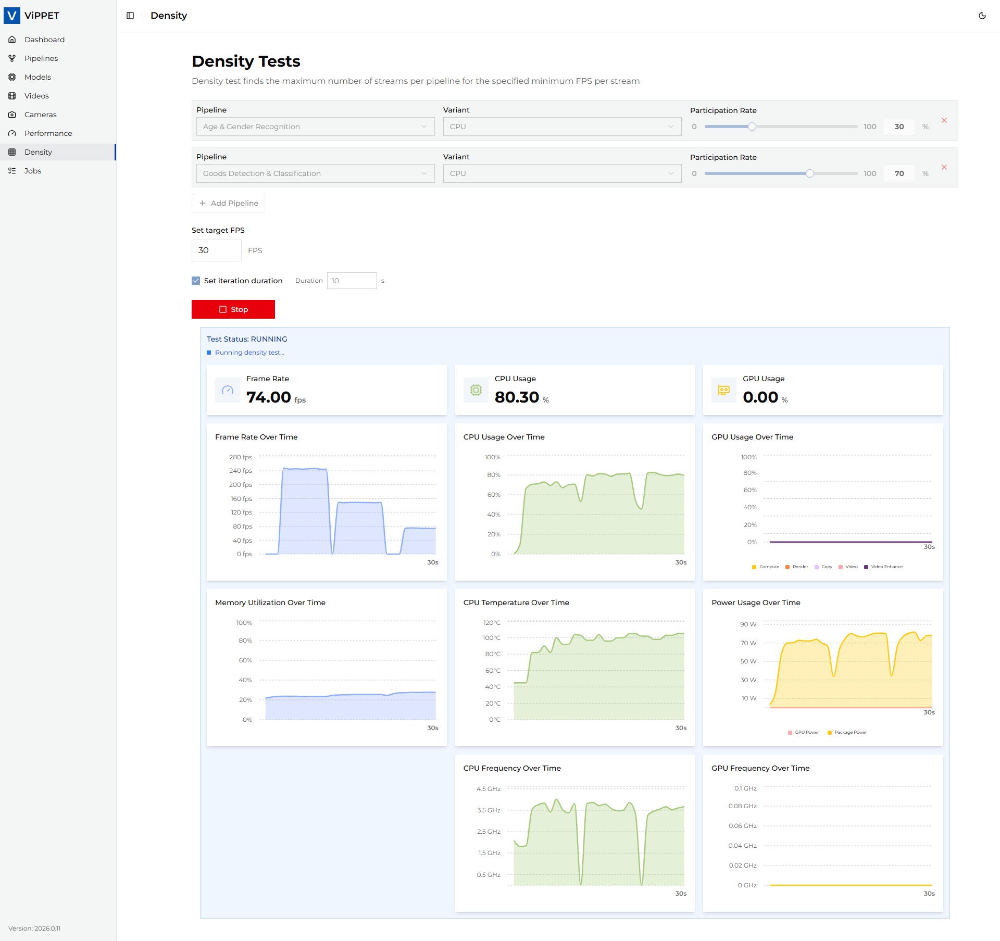
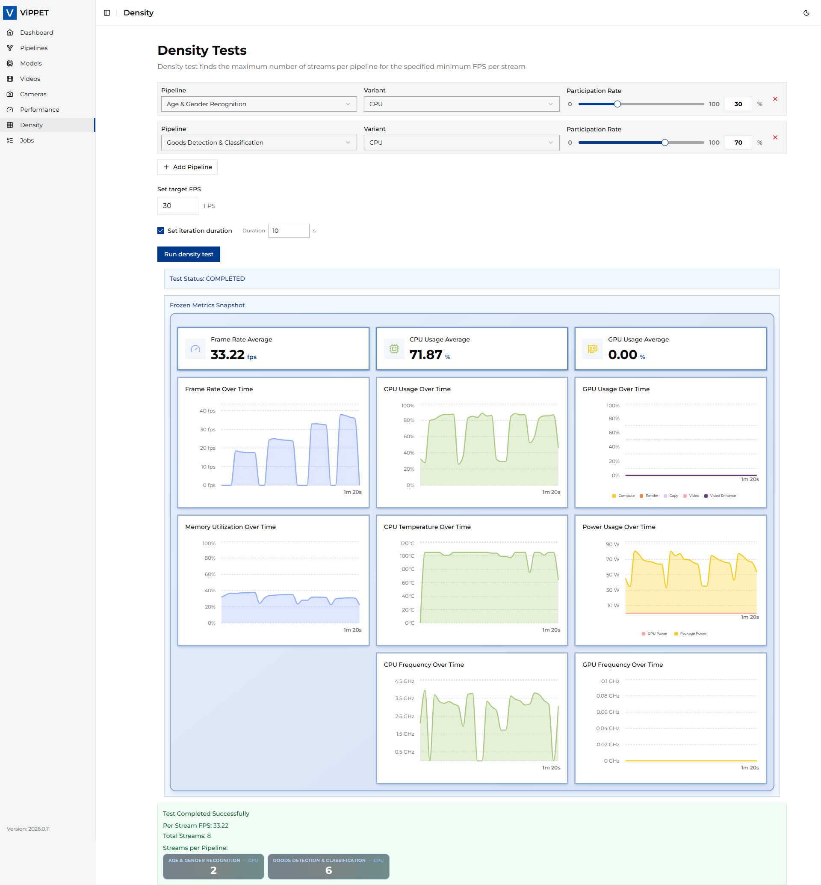

# Stream Density Testing

This article explains how to run density tests in ViPPET and interpret the results.
A density test finds the maximum number of streams that can run while keeping the target
minimum FPS per stream. Compared to a standard performance test (fixed stream count),
density testing increases the load and searches for the highest stable stream count that
still meets your FPS requirement.
Therefore, it answers the question: `How many concurrent streams can this platform sustain
at my required FPS floor?`

## Density Modes

Density testing supports two modes. The mode is selected automatically from the request
shape — no API version change is required.

| Mode        | When to use it                                                                                              | Search variable                                                                                       |
|-------------|-------------------------------------------------------------------------------------------------------------|-------------------------------------------------------------------------------------------------------|
| **Classic** | One or more pipelines tested together; you want the platform's total stream capacity for a workload mix.    | Total stream count, distributed across pipelines using their per-pipeline `stream_rate` ratios.       |
| **Mixed**   | Exactly two pipelines; one pipeline has a fixed input stream count, the other one is grown by the search.   | Stream count of the *incremented* pipeline only. The *fixed* pipeline keeps its `streams` value.      |

Mode selection is driven by the new optional `streams` field on each pipeline spec:

- If **no** spec sets `streams`, the request runs in **classic mode**.
- If **exactly one** of **two** specs sets `streams`, the request runs in **mixed mode**.
- Any other combination (one spec with `streams`, three specs, both with `streams`, etc.)
  is rejected with HTTP 400.

Both modes use the same exponential-growth + binary-search algorithm and the same pass/fail
criterion (`fps_floor`). Only the meaning of the search variable differs.

## Density Testing Algorithm

The density testing algorithm is designed to find the maximum number of concurrent video
streams that can be processed while maintaining a minimum performance threshold (FPS floor).
The algorithm uses a two-phase approach:

### Phase 1: Exponential Growth

- Start with `search_value = 1` and run the pipeline.
- Double `search_value` after each successful run that meets the FPS threshold.
- Continue exponentially (`1 -> 2 -> 4 -> 8 -> 16...`) until the per-stream FPS drops below the specified `fps_floor`.
- Track the best configuration that still meets the performance requirements.

### Phase 2: Binary Search Refinement

- Switch to binary search once performance drops below the threshold.
- Set bounds:
  - Lower bound = last successful `search_value` (`N/2`).
  - Upper bound = current failing `search_value` (`N`).
- Bisect the range and test the midpoint.
- Adjust bounds based on results:
  - If `FPS >= threshold`: update best config, move lower bound up.
  - If `FPS < threshold`: move upper bound down.
- Continue until bounds converge.

The meaning of `search_value` depends on the mode:

- **Classic mode** — `search_value` is the total stream count across all pipelines.
- **Mixed mode** — `search_value` is the stream count of the *incremented* pipeline only.
  The *fixed* pipeline keeps its `streams` value on every iteration; total stream count is
  `fixed_streams + search_value`.

### Stream Distribution

Stream distribution differs per mode:

- **Classic mode** — Multiple pipelines can be tested simultaneously. Stream allocation is
  proportional based on `stream_rate` ratios (must sum to `100%`). Rounding handling: the
  last pipeline gets remaining streams to account for rounding errors.
- **Mixed mode** — Exactly two pipelines. The pipeline that sets `streams` is pinned to
  that value on every iteration. The other pipeline starts at `1` stream and is incremented
  by the algorithm. `stream_rate` is ignored in mixed mode.

### Algorithm result

The algorithm returns the optimal configuration with:

- Maximum number of streams that meet the FPS requirement.
- Distribution of streams across pipelines.
- Achieved per-stream FPS.
- Output file paths for video results (from the best-passing iteration).
- Latency statistics (avg/min/max) when latency metrics are enabled.

## Running Density Testing

Density testing helps you find the maximum number of concurrent streams that still
meet a required FPS floor.

### Step 1: Test Configuration

Before running the test, configure the workload in the **Density** tab.

#### Classic mode configuration

1. Open the **Density** tab.
2. Set **FPS Floor** — minimum acceptable per-stream FPS (for example, `30`).
3. Add one or more pipelines.
4. For each pipeline, set **Stream Rate** so all pipelines sum to `100%`.
5. Leave **Streams** unset on every pipeline (this keeps the request in classic mode).
6. Set **Max runtime** — duration of each iteration in seconds (for example, `10`).

| Parameter                  | Description                                                                                                      | Example                              |
|----------------------------|------------------------------------------------------------------------------------------------------------------|--------------------------------------|
| **FPS Floor**              | Minimum acceptable per-stream FPS. The algorithm stops when it cannot maintain this threshold.                   | `30`                                 |
| **Stream Rate**            | Percentage of total streams allocated to this pipeline. All rates must sum to 100%.                              | Pipeline A: `60%`, Pipeline B: `40%` |
| **Max runtime**            | How long each iteration runs before measuring FPS (seconds). Longer iterations provide more stable measurements. | `10`                                 |
| **Output mode**            | `disabled` or `file`. Live streaming is not supported for density tests.                                         | `disabled`                           |
| **Enable latency metrics** | When enabled, measures end-to-end pipeline latency (avg/min/max) per reporting interval.                         | `disabled`                           |

> **Note:** USB cameras are not supported in density testing because the algorithm needs to spawn
> multiple copies of the same pipeline, which is not possible with a single physical camera device.

#### Mixed mode configuration

Use mixed mode when one pipeline must run at a known, fixed input stream count and you want
to find out how many streams of a second pipeline the platform can run on top of it.

1. Open the **Density** tab.
2. Set **FPS Floor** — minimum acceptable per-stream FPS (for example, `30`).
3. Add **exactly two** pipelines.
4. On the pipeline you want to pin, set **Streams** to a positive integer (the fixed input
   stream count). Leave **Streams** unset on the other pipeline — that one will be
   incremented by the search.
5. **Stream Rate** is ignored in mixed mode and can be left at any value.
6. Set **Max runtime** as in classic mode.

| Parameter                          | Description                                                                                    | Example    |
|------------------------------------|------------------------------------------------------------------------------------------------|------------|
| **FPS Floor**                      | Minimum acceptable per-stream FPS. The algorithm stops when it cannot maintain this threshold. | `30`       |
| **Streams** *(fixed pipeline)*     | Fixed input stream count for the pinned pipeline. Must be a positive integer.                  | `4`        |
| **Streams** *(grown pipeline)*     | Leave unset. The search starts at `1` and is incremented by the algorithm.                     | *(unset)*  |
| **Max runtime**                    | How long each iteration runs before measuring FPS (seconds).                                   | `10`       |
| **Output mode**                    | `disabled` or `file`. Live streaming is not supported for density tests.                       | `disabled` |
| **Enable latency metrics**         | When enabled, measures end-to-end pipeline latency (avg/min/max) per reporting interval.       | `disabled` |

> **Note:** Mixed mode is restricted to **exactly two** pipelines with **exactly one** of
> them setting `streams`. The backend rejects any other combination with HTTP 400.

<!-- //TODO: Add screenshot of the Density tab configured in mixed mode
     (one pipeline with a fixed Streams value, one without). -->

### Step 2: Running the Test

After configuration, click **Run density test**.

What happens during execution:

- ViPPET starts the search variable at `1` and runs the pipelines for `max_runtime` seconds.
- In **classic mode** the search variable is the total stream count; in **mixed mode** it
  is the stream count of the incremented pipeline (the fixed pipeline keeps its `streams`
  value).
- If per-stream FPS ≥ `fps_floor`, the search variable doubles (exponential growth phase).
- When FPS drops below `fps_floor`, ViPPET switches to binary search to refine the exact maximum.
- The process ends when the algorithm converges on the best stable configuration.
- Progress is reported in real time via the job status details.

> **Important:** If you cancel a density test while it is running, the job is marked as **FAILED**.
> Partial density results are not reported because the algorithm has not yet converged on a reliable answer.

<!-- //TODO: Add screenshot of an in-progress mixed-mode density job showing
     the fixed pipeline pinned and the other pipeline being incremented. -->

### Step 3: Interpreting Test Results

When the job completes, ViPPET reports the best configuration that met the FPS floor:

| Result                        | Description                                                                            |
|-------------------------------|----------------------------------------------------------------------------------------|
| **Per Stream FPS**            | Achieved FPS per stream in the best configuration (≥ fps_floor)                        |
| **Total Streams**             | Maximum number of concurrent streams that sustained the required FPS                   |
| **Streams per Pipeline**      | Distribution of streams across pipelines (see note below)                              |
| **Output videos**             | Paths to output files from the best iteration (if output mode was `file`)              |
| **Latency (avg / min / max)** | End-to-end pipeline latency in milliseconds, reported when latency metrics are enabled |

**Streams per Pipeline interpretation:**

- **Classic mode** — values follow the per-pipeline `stream_rate` ratios.
- **Mixed mode** — the fixed pipeline keeps its `streams` value; the other pipeline shows
  the highest stream count that still met `fps_floor`.

<!-- //TODO: Add screenshot of a completed mixed-mode density job result
     showing the fixed and incremented per-pipeline stream counts. -->

## Comparing results across platforms

Use density results to compare hardware capabilities:

- Higher **total streams** at the same FPS floor indicates better density — the platform can handle more workloads.
- **Per-stream FPS** should stay at or above the configured floor.
- For stable comparison between platforms, keep the same FPS floor, input video, and pipeline configuration.
- Compare results across devices (CPU vs GPU vs NPU) using the same test profile.
- When comparing **mixed mode** results, keep the fixed pipeline's `streams` value identical
  across platforms — otherwise you are measuring a different workload.

### Example: reading density results

**Classic mode.** If you set `fps_floor = 30` and the test reports `total_streams = 12` with
`per_stream_fps = 31.5`:

- The platform can run **12 concurrent streams** of this pipeline while maintaining at least 30 FPS per stream.
- At 13 streams, per-stream FPS dropped below 30, so the algorithm reported 12 as the maximum.
- The actual measured FPS (31.5) slightly exceeds the floor — this is the result from the best-passing iteration.

**Mixed mode.** If you pin pipeline A to `streams = 4`, leave pipeline B for incrementing,
set `fps_floor = 30`, and the test reports `total_streams = 7` with `per_stream_fps = 30.8`
and per-pipeline counts `[A: 4, B: 3]`:

- Pipeline A always ran with **4 streams** (the pinned value).
- The platform could additionally sustain **3 streams of pipeline B** while keeping every
  stream at or above 30 FPS.
- At 4 streams of pipeline B (so 8 streams in total) the per-stream FPS dropped below 30,
  so the algorithm reported 3 as the maximum for pipeline B.
