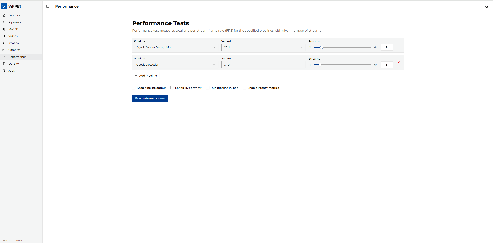
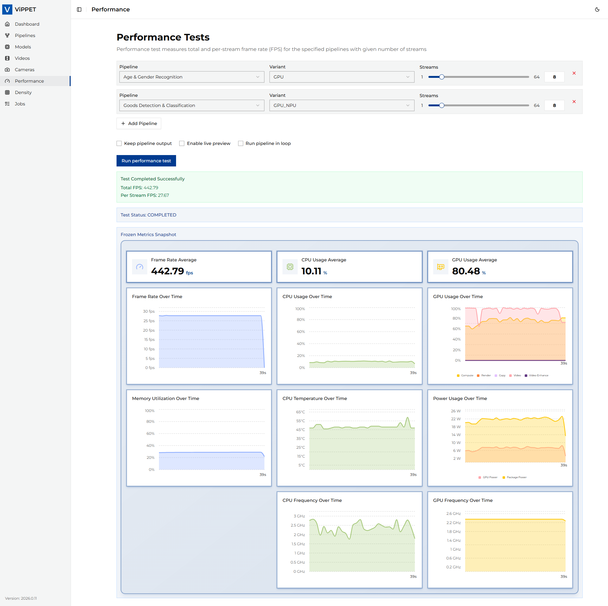
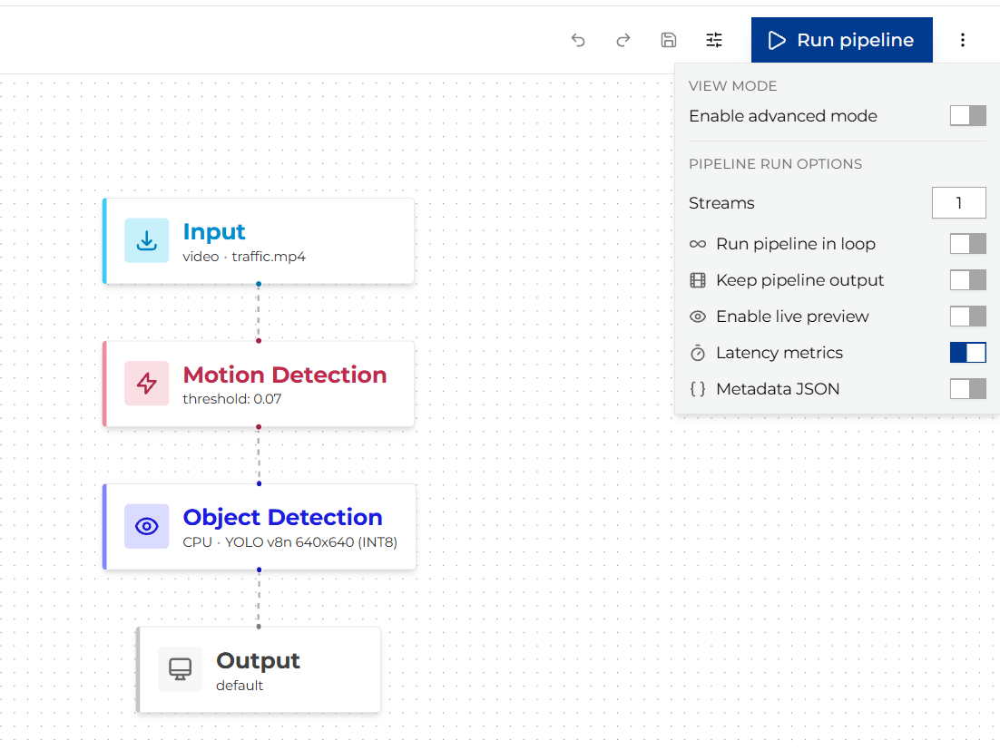
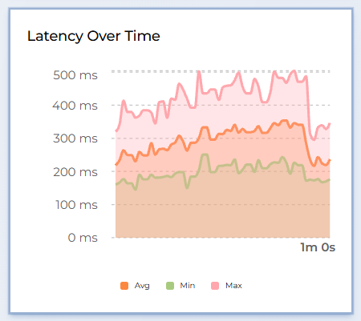

# Performance Testing

This article covers performance testing in ViPPET. Users can test single pipelines as well as
multiple pipelines running concurrently. Both testing modes provide the same metrics and optional
output videos, allowing users to evaluate system performance under different workload conditions.

## Test a single pipeline

First, navigate to the Performance page. Then, select the pipeline you want to test and specify
the number of streams to process.

### Configuration options

Before running the test, configure the following settings:

| Setting                    | Description                                                                                                                                   |
|----------------------------|-----------------------------------------------------------------------------------------------------------------------------------------------|
| **Pipeline**               | Select a pipeline variant to test                                                                                                             |
| **Streams**                | Number of parallel streams (copies of the pipeline) to run simultaneously                                                                     |
| **Output mode**            | `disabled` — no output saved; `file` — save output videos to disk; `live_stream` — stream via RTSP                                            |
| **Max runtime**            | Maximum execution time in seconds (0 = run until end of video source)                                                                         |
| **Metadata mode**          | `disabled` — no metadata; `file` — save inference metadata to disk                                                                            |
| **Enable latency metrics** | When enabled, measures end-to-end pipeline latency (avg/min/max) per reporting interval. See [Latency metrics](#latency-metrics) for details. |

Once all settings are configured, click *Run performance test*.

### Monitoring metrics during execution

While the test runs, the dashboard displays real-time metrics:

- **System metrics** — CPU, GPU, NPU utilization, memory usage, and power consumption
- **Pipeline metrics** — Total FPS and Per Stream FPS
- **Latency metrics** — Average, minimum, and maximum buffer latency per reporting interval
  (when [latency metrics](#latency-metrics) are enabled)

### Interpreting results

When the test completes, the application reports:

| Metric                        | Description                                                                            |
|-------------------------------|----------------------------------------------------------------------------------------|
| **Total FPS**                 | Aggregate throughput across all streams                                                |
| **Per Stream FPS**            | Average throughput per individual stream (Total FPS ÷ stream count)                    |
| **Output videos**             | Paths to recorded output files (if output mode was `file`)                             |
| **Live stream URLs**          | RTSP URLs for live viewing (if output mode was `live_stream`)                          |
| **Latency (avg / min / max)** | End-to-end pipeline latency in milliseconds, reported when latency metrics are enabled |

## Test multiple pipelines

You can test multiple pipelines running concurrently to simulate a realistic multi-workload scenario.

1. Select a pipeline from the list.
2. Click *+ Add Pipeline* to add additional pipelines.
3. Configure the number of streams for each pipeline independently.
4. Set shared execution options (output mode, max runtime).
5. Click *Run performance test*.

While testing, real-time system metrics are displayed in the dashboard. The application reports *Total FPS*
and *Per Stream FPS* metrics across all pipelines combined, and provides the output videos from the test
if *Save output* was enabled.

> **Tip:** Multi-pipeline tests are useful for understanding how different workloads compete for hardware
> resources. For example, you can test a detection pipeline alongside a classification pipeline to see
> how GPU utilization is shared.

## Latency metrics

Latency metrics show end-to-end pipeline processing time — how long each video frame takes to travel from the
source element to the sink element. This helps you identify bottlenecks and evaluate whether a pipeline meets
real-time requirements.

### Enabling latency metrics

To enable latency measurement for a pipeline run, set the **Enable latency metrics** toggle (or
`enable_latency_metrics: true` in the API request body) before starting the test.

When enabled, ViPPET configures GStreamer's built-in `latency_tracer` which samples the pipeline every
1 000 ms and reports statistics for each interval.

> **Note:** Enabling latency metrics adds minimal overhead to the pipeline. The tracer operates passively —
> it timestamps buffers at the source and measures arrival time at the sink without modifying the data path.

### Reading the latency chart

Once the pipeline is running with latency metrics enabled, the dashboard displays a real-time latency chart
with three lines:

| Metric            | Meaning                                                                                                                                             |
|-------------------|-----------------------------------------------------------------------------------------------------------------------------------------------------|
| **avg** (average) | Mean buffer latency during the 1-second reporting interval. This is the most representative value for overall pipeline responsiveness.              |
| **min** (minimum) | Shortest buffer latency observed in the interval. Represents the best-case processing time.                                                         |
| **max** (maximum) | Longest buffer latency observed in the interval. Spikes here indicate occasional stalls (e.g., model inference on a complex frame, I/O contention). |

All values are reported in **milliseconds (ms)**.

**How to interpret the values:**

- **Stable average close to minimum** — the pipeline processes frames consistently with little variation.
- **Large gap between minimum and maximum** — some frames take significantly longer than others. This may indicate
  bursty inference workloads or resource contention with other streams.
- **Rising average over time** — the pipeline may be experiencing back-pressure (e.g., the system is becoming
  saturated as more streams are added).
- **Average below target frame interval** — the pipeline meets real-time requirements. For example, if your
  target is 30 FPS, the frame interval is around 33 ms; an average latency below 33 ms means the pipeline keeps up.

### Latency in multi-stream tests

When running multiple streams, latency is reported per stream (identified by source → sink element pair).
The chart displays all streams simultaneously so you can compare their behavior and detect uneven resource
allocation.
