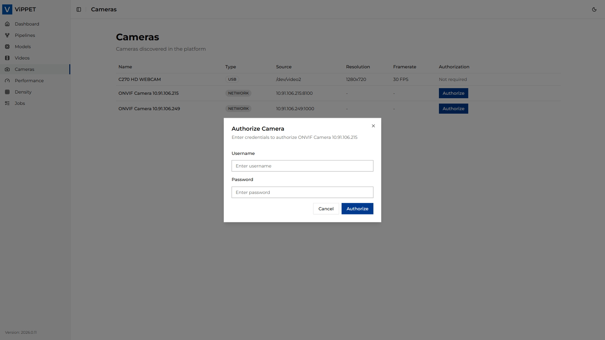
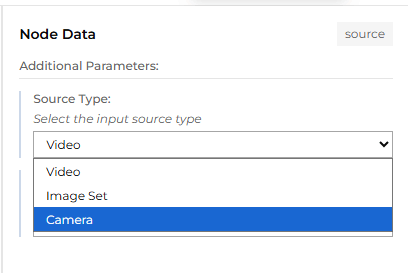
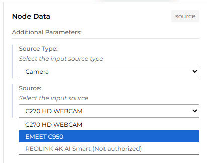

# Cameras

This article explains how to use the Camera module in ViPPET to detect and connect to cameras.
From the left-side menu, choose **Cameras** to open the camera management page.

ViPPET supports two types of cameras: USB cameras and network cameras. USB cameras are detected
automatically via plug-and-play, while network cameras are discovered using the ONVIF standard.

## USB Cameras

Connecting a USB camera requires no additional configuration. Simply plug the camera into the host
machine. ViPPET automatically detects the device and displays it in the *Cameras* tab.

## Network Cameras

### Network camera discovery

Network cameras are discovered using the ONVIF standard. Before ViPPET can detect a network camera,
you must configure it correctly:

1. **Enable the ONVIF service** on the camera. Refer to the camera manufacturer's documentation for
   instructions on how to do this.
2. **Create an ONVIF media profile** on the camera, defining the desired stream settings (resolution,
   encoding, frame rate, and so on).
3. **Connect the camera to the same subnet** as the host machine running ViPPET. The ONVIF discovery
   agent uses multicast to find cameras, so the camera must be reachable within the local network
   segment.

Once the camera is properly configured and connected to the network, ViPPET automatically discovers
and displays it in the *Cameras* tab.

> **Note:** If a network camera does not appear in the *Cameras* tab, verify that the ONVIF service is
> enabled, a valid media profile exists, and the camera is on the same subnet as the host machine.

### Network camera authorization

After a network camera is discovered, authorization is required before it can be used. An *Authorize*
button appears next to the camera entry in the *Cameras* tab.

To authorize a camera:

1. Click the *Authorize* button next to the camera.
2. Enter the camera's *Username* and *Password*.
3. Confirm. If the credentials are accepted, the camera status changes to *Authorized*.

> **Note:** If authorization fails, verify that the username and password are correct, and ensure that
> the clock on the camera is synchronized with the clock on the host machine. Time skew between the
> camera and the host is a common cause of ONVIF authentication failures.

## GigE Vision Cameras

*To be addressed in the 2026.2 release.*

## Use cameras in pipelines as input sources

To use a camera as pipeline input, open the Pipeline Builder and click the **Input** block to see the properties.

From the *Source Type* dropdown, select **Cameras**.

Then, from the *Source* dropdown, select the desired camera.

The selected camera will now be used as the pipeline input.

> **Note:** A network camera that has not been authorized yet appears grayed out in the list and cannot
> be selected. To authorize the camera first, follow the steps in the
> [Network camera authorization](#network-camera-authorization) section.
