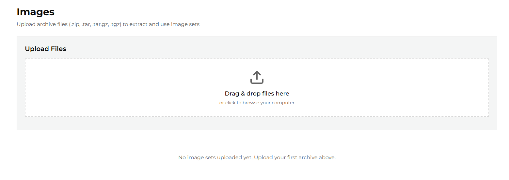
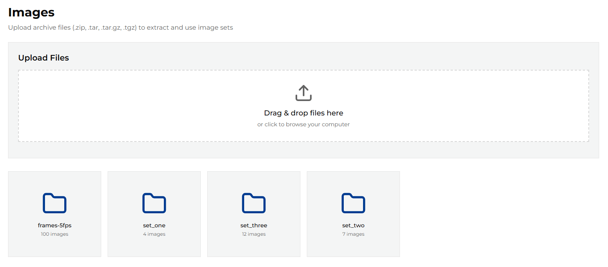
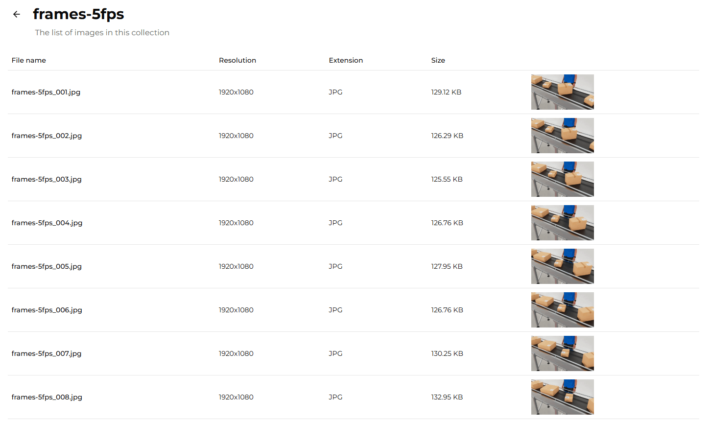
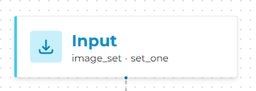
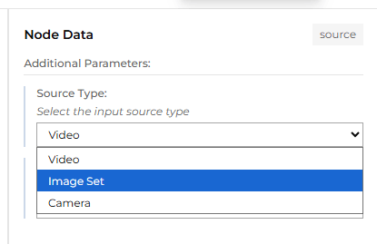
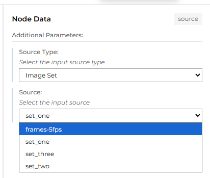

# Image Sets

## Upload Image sets

To use images as pipeline input, you must first upload them to the server.

From the left-side menu, choose **Images** to open the image management page.
This page lists images grouped into directories called *Image Sets*.

The application does not provide any default images, so the list is empty initially.

You can use the uploader to add your own image sets. The uploader accepts packages in any of the following formats:

- `.zip`
- `.tar`
- `.tar.gz`
- `.tgz`

All images in a package must have **the same dimensions** and extension. The maximum allowed package size is **2 GB**.

After upload, the images are extracted into a directory named after the package file (without its extension).
This directory name is then used as the *Image Set* name when selecting images as pipeline input.

> **Note:** During upload, images are processed in alphabetical order and then renamed to the
> `<file_name>_<NNNN>.<ext>` pattern.

To preview images in a set, click the set name.

The details page displays all images in the selected set, along with their basic properties and previews.

## Selecting an image set as pipeline input

To use an image set as pipeline input, open the Pipeline Builder and click the **Input** block to see the properties.

From the *Source Type* dropdown, select **Image Set**.

Then, from the *Source* dropdown, select the desired image set.

The selected image set will now be used as the pipeline input.
