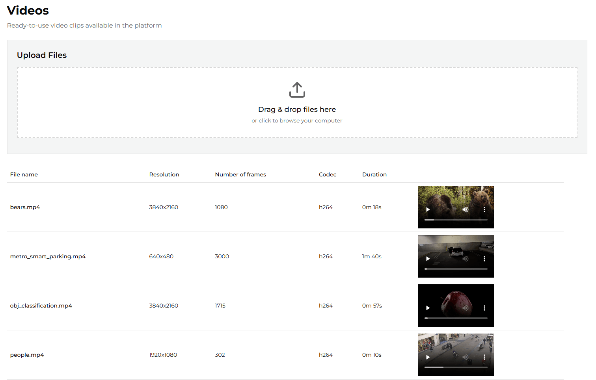
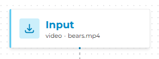
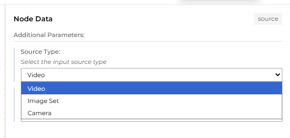
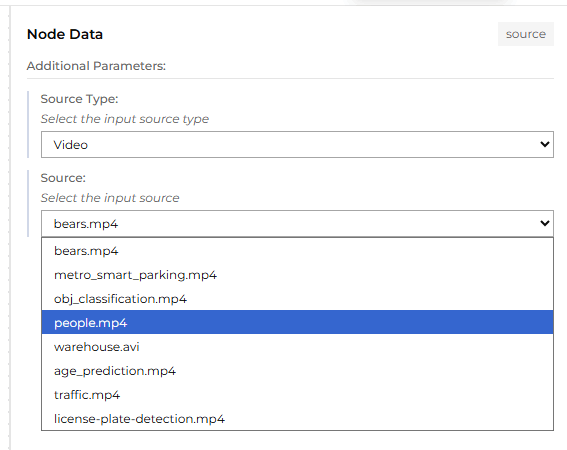

# Videos

## Available videos

From the left-side menu, choose **Videos** to open the video management page.
This page lists all available videos, along with their basic properties and previews. The application
includes a set of sample videos that can be used as pipeline input.

You can also upload your own videos to use as pipeline input. The maximum allowed file size is **2 GB**.

## Uploading a video

To upload a video, click the **Upload** button on the Videos page and pick a file from your machine.
The UI shows progress while the file is being transferred, then a success confirmation or, if the
upload is rejected, an error message explaining what went wrong.

Before the file is accepted, ViPPET runs two layers of validation:

1. **Pre-write checks** (before any bytes touch disk):
    - the filename is present and contains only safe characters (letters, digits, dot, underscore,
      hyphen and space; no path separators);
    - the file extension is in the allow-list;
    - no video with the same basename already exists on the server.
2. **Post-write checks** (after the upload finishes streaming to a temporary file):
    - the container format is in the allow-list;
    - the codec is in the allow-list;
    - the file can be opened by the video decoder.

If any check fails, the temporary file is removed and the request is rejected with an explanatory
error (see [Upload errors and how to resolve them](#upload-errors-and-how-to-resolve-them) below).

## Supported formats

The following extensions, container formats, and codecs are accepted by default. Operators can
narrow or widen each list through environment variables (see
[Configuring upload limits](#configuring-upload-limits)).

| Group                 | Default allow-list                                             |
|-----------------------|----------------------------------------------------------------|
| **File extensions**   | `mp4`, `mkv`, `mov`, `avi`, `ts`, `264`, `avc`, `h265`, `hevc` |
| **Container formats** | `mp4`, `mov`, `mkv`, `avi`, `mpegts`, `raw`                    |
| **Video codecs**      | `h264`, `h265`                                                 |

The `raw` container covers H.264 / H.265 elementary streams (files with the `.264`, `.avc`, `.h265`,
or `.hevc` extension), which have no container wrapper.

## What happens after upload

When all checks pass, ViPPET:

1. Moves the temporary file into the `uploaded` directory under its original basename.
2. Probes the video to extract metadata (width, height, frame rate, frame count, codec, duration)
   and writes a JSON sidecar next to the video.
3. Converts the video to MPEG-TS (kept alongside the original file) so that pipelines requiring a
   seekable TS source can use it without re-encoding at run time.
4. Registers the new entry in the in-memory video cache so it appears immediately in the Videos
   page and in the Pipeline Builder's input dropdown.

## Where uploaded videos live

ViPPET stores input videos in two parallel locations inside the shared `videos/input/` folder:

| Subdirectory             | Contents                                                                                                  |
|--------------------------|-----------------------------------------------------------------------------------------------------------|
| `videos/input/auto/`     | Videos auto-downloaded at startup from `default_recordings.yaml`. Managed by ViPPET; do not edit by hand. |
| `videos/input/uploaded/` | Videos uploaded by the user through the **Upload** button or the `POST /videos/upload` API.               |

Filenames are **globally unique** across the two subdirectories: an upload that collides with an
auto-downloaded recording is rejected with a `file_exists` error. The auto-generated MPEG-TS copy
and the metadata JSON sidecar live in the same subdirectory as their source file.

## Configuring upload limits

Four environment variables on the `vippet-app` service control what the upload endpoint accepts.
Change them in `compose.yml` and restart the stack to take effect.

| Variable                    | Default                                | Description                                                                                                                                                                                   |
|-----------------------------|----------------------------------------|-----------------------------------------------------------------------------------------------------------------------------------------------------------------------------------------------|
| `UPLOAD_ALLOWED_EXTENSIONS` | `mp4,mkv,mov,avi,ts,264,avc,h265,hevc` | Comma-separated list of file extensions accepted by `POST /videos/upload`. Case-insensitive.                                                                                                  |
| `UPLOAD_ALLOWED_CONTAINERS` | `mp4,mov,mkv,avi,mpegts,raw`           | Comma-separated list of container formats accepted after probing the uploaded file. `raw` covers H.264 / H.265 elementary streams.                                                            |
| `UPLOAD_ALLOWED_CODECS`     | `h264,h265`                            | Comma-separated list of video codecs accepted after probing.                                                                                                                                  |
| `UPLOAD_MAX_SIZE_BYTES`     | `2147483648` (2 GiB)                   | Maximum accepted upload body size in bytes. Enforced per chunk while streaming the upload to disk. Keep in sync with the `client_max_body_size` directive in `ui/nginx.conf` if you raise it. |

> **Note:** Tightening these allow-lists never deletes files that are already on disk; it only prevents new
> uploads from being accepted. Widening the codec or container list does not implicitly add the
> matching file extensions - extend `UPLOAD_ALLOWED_EXTENSIONS` as well.

## Upload errors and how to resolve them

Every rejected upload returns HTTP 422 with a structured body that carries an `error` discriminator,
a human-readable `detail` message, and (where useful) the offending `found` value plus the `allowed`
list. The UI surfaces the `detail` text in the upload dialog.

| `error`                 | What it means                                                                                                                           | How to resolve                                                                                                         |
|-------------------------|-----------------------------------------------------------------------------------------------------------------------------------------|------------------------------------------------------------------------------------------------------------------------|
| `missing_filename`      | The request did not include a usable filename, or the filename contained unsafe characters (path separators, control characters, etc.). | Rename the file to use only letters, digits, dot, underscore, hyphen, and space, and try again.                        |
| `unsupported_extension` | The file extension is not in `UPLOAD_ALLOWED_EXTENSIONS`.                                                                               | Convert the file to one of the allowed formats, or ask the operator to extend the allow-list.                          |
| `file_too_large`        | The streamed body exceeded `UPLOAD_MAX_SIZE_BYTES`. The temporary file is deleted as soon as the limit is crossed.                      | Split or re-encode the video to a smaller size, or ask the operator to raise the limit (and the matching nginx limit). |
| `file_exists`           | Another video with the same basename already exists in `videos/input/auto/` or `videos/input/uploaded/`.                                | Rename the file before uploading, or delete the existing entry first.                                                  |
| `unsupported_container` | The probed container format is not in `UPLOAD_ALLOWED_CONTAINERS`. This usually means the file has a misleading extension.              | Re-encode into a supported container, or ask the operator to extend the allow-list.                                    |
| `unsupported_codec`     | The probed video codec is not in `UPLOAD_ALLOWED_CODECS` (by default, only `h264` and `h265`).                                          | Re-encode the video into H.264 or H.265, or ask the operator to extend the allow-list.                                 |
| `invalid_video`         | The video decoder could not open the file. The file is most likely corrupted, truncated, or not actually a video.                       | Re-export the file from the original source and try again.                                                             |

The endpoint, request body, and full response schema (including the `VideoUploadError` model) are
also documented in the live OpenAPI reference at `/docs` (Swagger UI) and `/redoc`.

## Selecting a video as pipeline input

To use a video as pipeline input, open the Pipeline Builder and click the **Input** block to see the properties.

From the *Source Type* dropdown, select **Video**.

Then, from the *Source* dropdown, select the desired video.

The selected video will now be used as the pipeline input.
