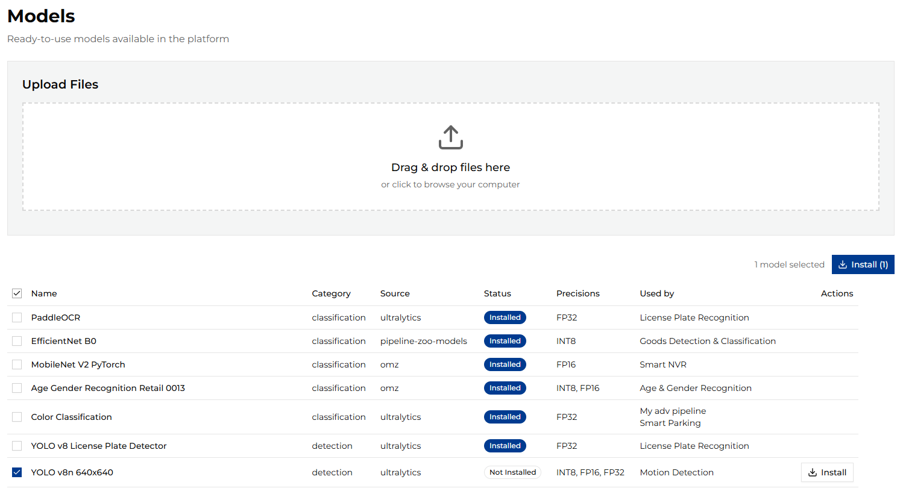
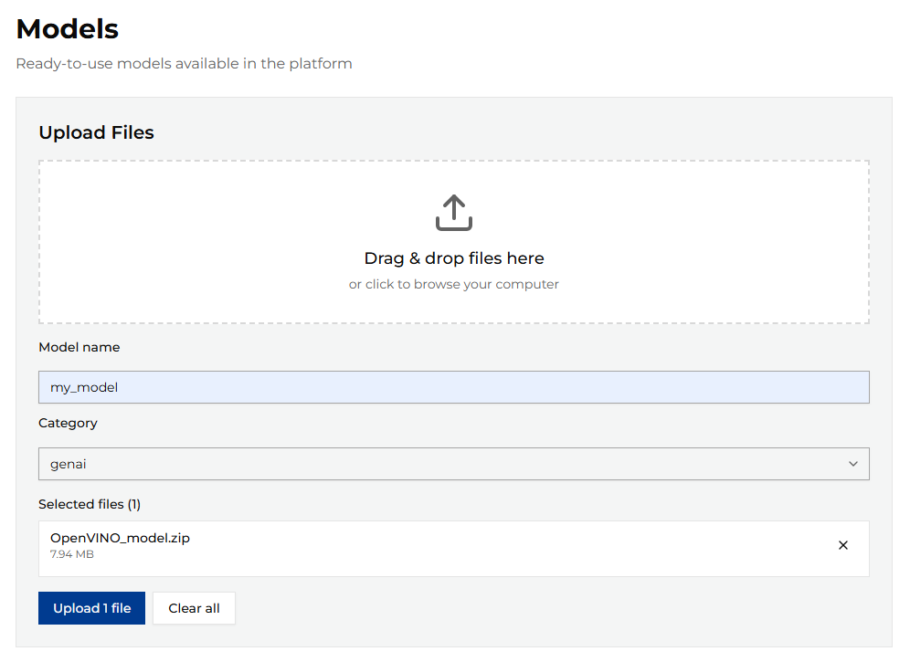

# Model Management

To run AI pipelines in ViPPET, you need models available in the system.
After the first installation, you must manually select and download the models you want to use in your pipelines.
ViPPET provides a list of supported models that you can download with the download manager.
You can also upload your own custom models to ViPPET and use them in your pipelines.

To manage models, go to the Models page in the ViPPET UI.

## Supported Models

The table shows the supported models that you can download and use in your pipelines.
You can review model details such as:

- Category - The model category, for example object detection or image classification.
- Source - Where the model is downloaded from.
- Status - The current model status.
- Precisions - The list of available precisions for the model.
- Used by - The list of pipelines that use the model.

You can select one or more models and click the "Install" button to download them to ViPPET.

## Uploading Custom Models

You can also upload your own custom models to ViPPET and use them in your pipelines.
The package must be in .zip format that satisfy OpenVINO™ format. It should contain:

- model.bin
- model.xml

More about OpenVINO™ IR format can be found in the [OpenVINO™ documentation](https://docs.openvino.ai/2026/documentation/openvino-ir-format.html).

Models can be prepared and trained using [Geti](https://docs.geti.intel.com/).

The maximum allowed file size is **500 MB**.

The upload form also requires you to provide additional information about the model:

- Model name - The name of the model.
- Category - The model category, for example object detection or image classification.

To upload the model, click the *Upload* button.
After a successful upload, the model appears in the model list and can be used in your pipelines.

<!--hide_directive
:::{toctree}
:hidden:

./model-management/geti
./model-management/huggingface

:::
hide_directive-->