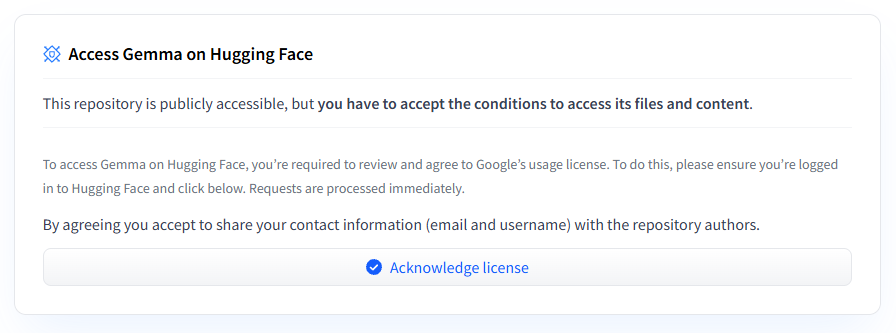

# Using Models from Hugging Face

To download a model from [Hugging Face](https://huggingface.co/) and use it in ViPPET pipelines,
you must provide your Hugging Face credentials in ViPPET.
To do this, set the `HF_TOKEN` environment variable and restart the ViPPET container.

In addition, some models on Hugging Face require access approval.
To accept the license terms, open the model page on Hugging Face and click **Acknowledge license**.

