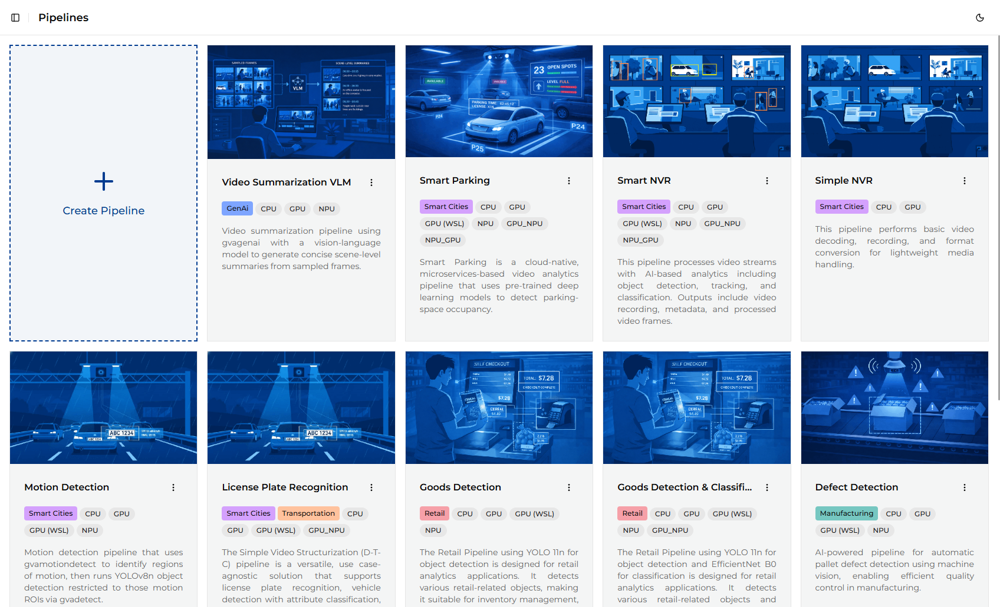
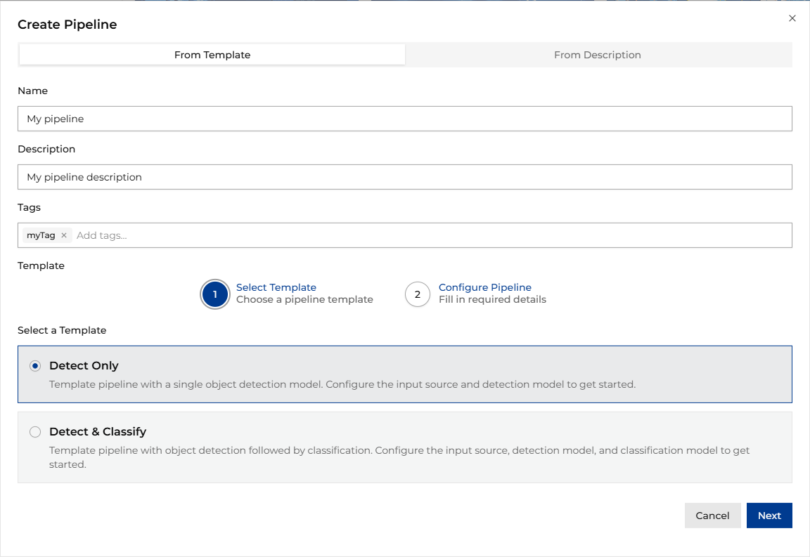
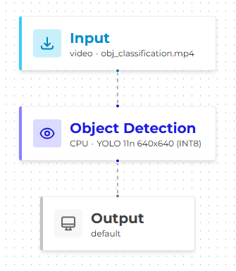
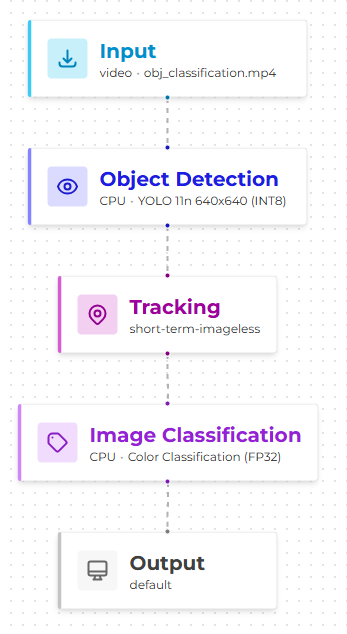
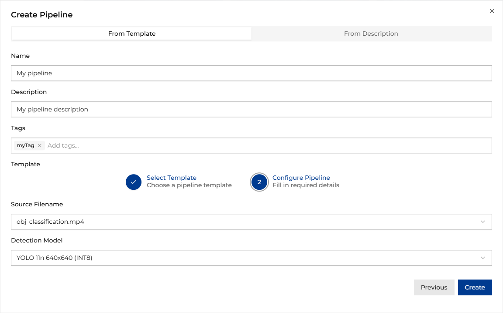
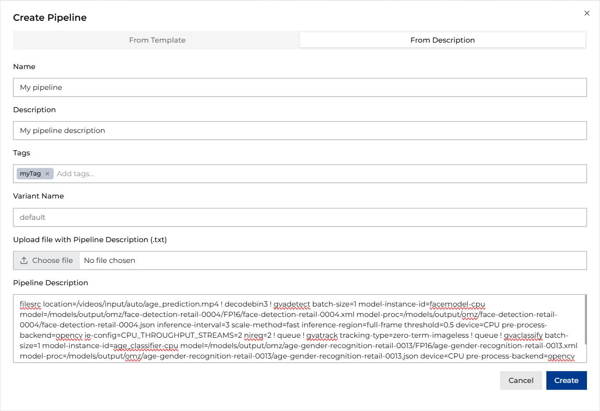
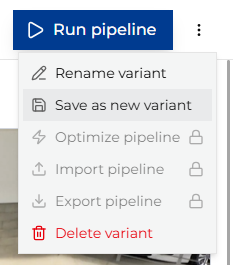
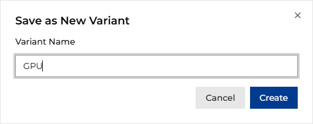

# Creating New Pipelines

To create a new pipeline, go to the Pipelines tab and then click the **Create Pipeline** button.

The new pipeline form opens.

## Creating Pipelines from Optimized Template

Fill in the required fields: `name`, `description`, and `tags`. In the next step, choose the template
to use. The templates are described below:

| Template                                        | Description                                                                                                                                                                                                                                                                                                                         |
|-------------------------------------------------|-------------------------------------------------------------------------------------------------------------------------------------------------------------------------------------------------------------------------------------------------------------------------------------------------------------------------------------|
|    | This template is used for detection-only pipelines. It includes a single inference stage for object detection, making it suitable for use cases where only bounding box predictions are required, such as object counting, presence detection, or motion tracking.                                                                  |
|  | This template is used for detection and classification pipelines. It includes two inference stages: object detection followed by classification. This enables more detailed analysis by first locating objects and then identifying their attributes or categories, such as vehicle type recognition or product quality inspection. |

In the last step, select the source file name and detection model. For templates with classification,
also select the classification model.

## Creating pipelines from GST description string

To create a pipeline from a GST description string, switch to the *From Description* tab and fill in the required fields:

- *Name* - Unique name for the pipeline
- *Description* - High-level pipeline description
- *Tags* - Tags used to categorize the pipeline
- *Variant Name* - Name of the pipeline variant. Default: "default"
- *Pipeline Description* - DL Streamer launch string (you can type it in the text field or upload it as a text file)

Once you provide this information, click the *Create* button. Once the pipeline description is validated, the pipeline
is shown as a graph in the Pipeline Builder view.

> **Note:** To view the output video or live stream in ViPPET, your pipeline must include a `fakesink` element with
> the `name=default_output_sink` property. This serves as a placeholder that ViPPET automatically replaces with the
> appropriate output configuration when you run the pipeline. For example: `... ! gvawatermark ! fakesink name=default_output_sink`.

To learn how to edit pipeline parameters and run pipelines, see [Configuring and Running Pipelines](./pipeline-execution.md).

## Pipeline Variants

Instead of creating multiple pipelines for different configurations, you can create pipeline variants.
A variant is a specific configuration of a pipeline that allows you to keep different parameters
(e.g., model, device) without the need to create separate pipelines.
This is particularly useful for comparing performance across different models or hardware
configurations while keeping the same overall pipeline structure.

From the menu next to the Run Pipeline button, select **Save as new variant**.

Next, provide a name for the variant and click *Create*. The new variant is created with the same
pipeline structure but can use different parameters (e.g., model, device).

