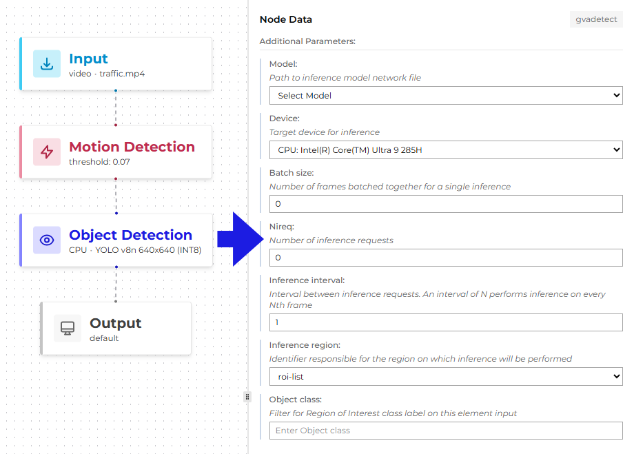
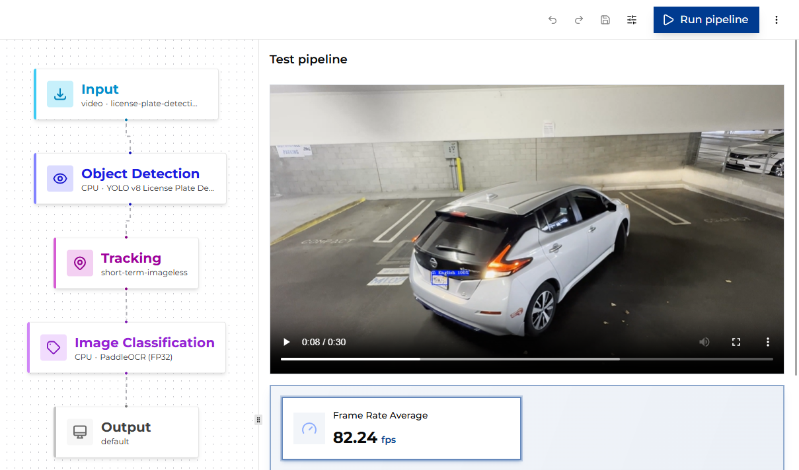
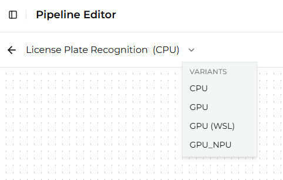

# Configuring and Running Pipelines

## Editing Pipeline Parameters

In the Pipeline Builder, you can view and configure the elements of the pipeline. For example, you can change
the *model* and *device* parameters in Object Detection and Object Classification elements.

## Running Pipelines on CPU

You can run the pipeline and save the output video using CPU-based encoding. Once the pipeline starts,
CPU utilization should visibly increase. The generated output video is then available for inspection.

## Running Pipelines on GPU

You can run the pipeline on a GPU to evaluate potential performance improvements. This requires updating the device
settings in the detection and classification components. After configuring the pipeline, run it and record
the output. During execution, GPU utilization should visibly increase.

With output saving enabled, the pipeline might not achieve maximum performance. You can then rerun the pipeline
with output saving disabled to measure the impact of I/O overhead.

## Switching Variants

If you have multiple variants of the same pipeline, you can easily switch between them to compare
performance across different configurations.
To switch variants, select the desired variant from the dropdown menu next to the pipeline name.
This allows you to quickly evaluate how different models or hardware settings affect the pipeline's
performance without needing to create separate pipelines for each configuration.

