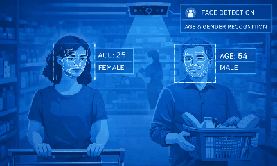
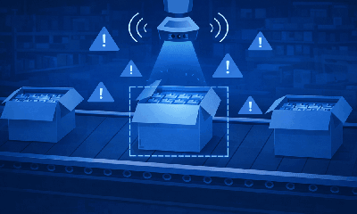
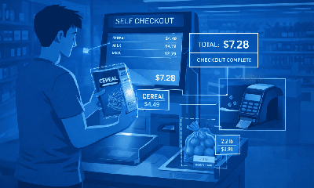
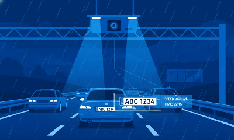
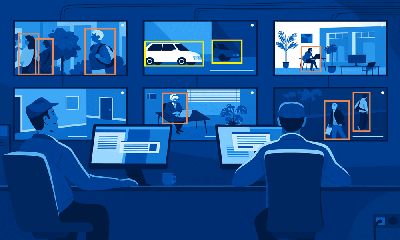
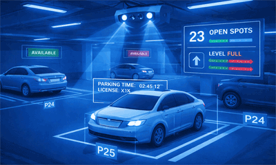

# Using Predefined Pipelines

The application includes several predefined pipelines. These pipelines cover common use cases and
can be customized to fit specific requirements.

| Pipeline                                                                                                                     | Description                                                                                                                                                                                                                                                         | Variants                                          |
|------------------------------------------------------------------------------------------------------------------------------|---------------------------------------------------------------------------------------------------------------------------------------------------------------------------------------------------------------------------------------------------------------------|---------------------------------------------------|
|                          | **Age and Gender Recognition**: Retail analytics pipeline using `face-detection-retail-0004` for face detection and `age-gender-recognition-retail-0013` for age and gender prediction. It is suited for customer demographics analysis and similar retail use cases. | Available in CPU, GPU, NPU, and GPU+NPU variants. |
|                                                    | **Defect Detection**: AI-powered pallet defect detection pipeline for manufacturing quality control using machine vision.                                                                                                                                           | Available in CPU, GPU, and NPU variants.          |
|                                                       | **Goods Detection**: Retail pipeline using YOLO 11n object detection to identify retail-related objects for inventory management, customer behavior analysis, and similar use cases.                                                                                | Available in CPU, GPU, and NPU variants.          |
|  | **Goods Detection and Classification**: Retail pipeline using YOLO 11n for detection and EfficientNet B0 for classification to identify and categorize retail-related objects.                                                                                        | Available in CPU, GPU, NPU, and GPU+NPU variants. |
|                         | **License Plate Recognition**: Simple Video Structurization (D-T-C) pipeline that supports license plate recognition, vehicle detection with attribute classification, and other adaptable detection and classification tasks based on the selected model.          | Available in CPU, GPU, NPU, and GPU+NPU variants. |
|                                                    | **Motion Detection**: Pipeline that uses `gvamotiondetect` to identify motion regions, then runs YOLOv8n object detection restricted to those motion ROIs through `gvadetect`.                                                                                      | Available in CPU, GPU, and NPU variants.          |
|                                                                      | **Simple NVR**: Lightweight media pipeline for basic video decoding, recording, and format conversion.                                                                                                                                                              | Available in CPU and GPU variants.                |
|                                                                         | **Smart NVR**: Video analytics pipeline that combines recording with AI-based object detection, tracking, and classification, and produces metadata and processed video frames.                                                                                     | Available in CPU, GPU, NPU, and GPU+NPU variants. |
|                                                             | **Smart Parking**: Cloud-native video analytics pipeline that uses pre-trained deep learning models to detect parking-space occupancy.                                                                                                                              | Available in CPU, GPU, NPU, and GPU+NPU variants. |
|                                         | **Video Summarization VLM**: Pipeline using `gvagenai` with a vision-language model to generate concise, scene-level summaries from sampled frames.                                                                                                                 | Available in CPU and GPU variants.                |
|                                                       | **Segmentation**: This is a segmentation pipeline preview. Segmentation is used to identify individual objects and separate them from the original image.                                                                                                           | Available in CPU and GPU variants.                |
|                                                  | **Human Pose Detection**: This is a classic physical security use case that detects human poses in real-time. It is particularly useful in use cases such as slip-and-fall detection in elderly care facilities, hospitals, and public spaces.                      | Available in CPU and GPU variants.                |
