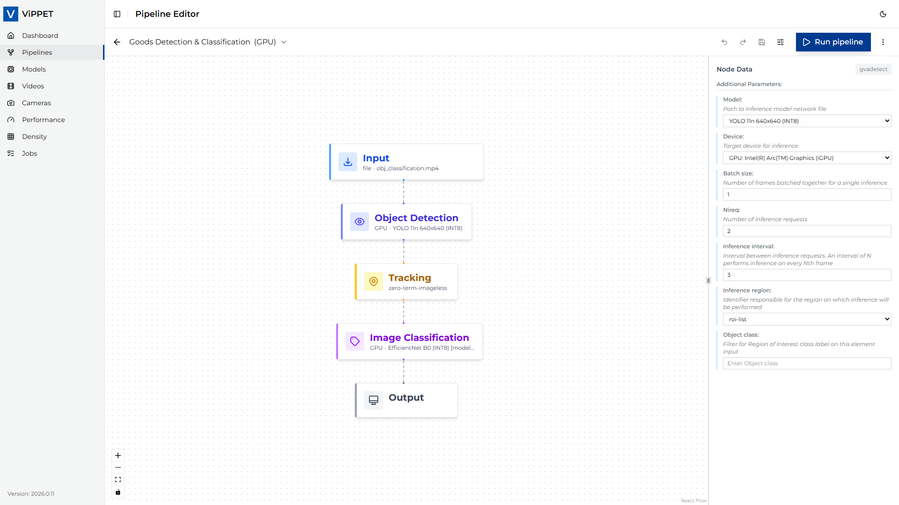
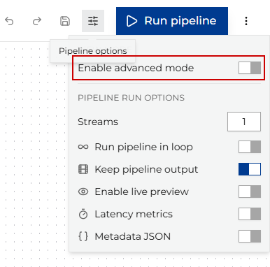
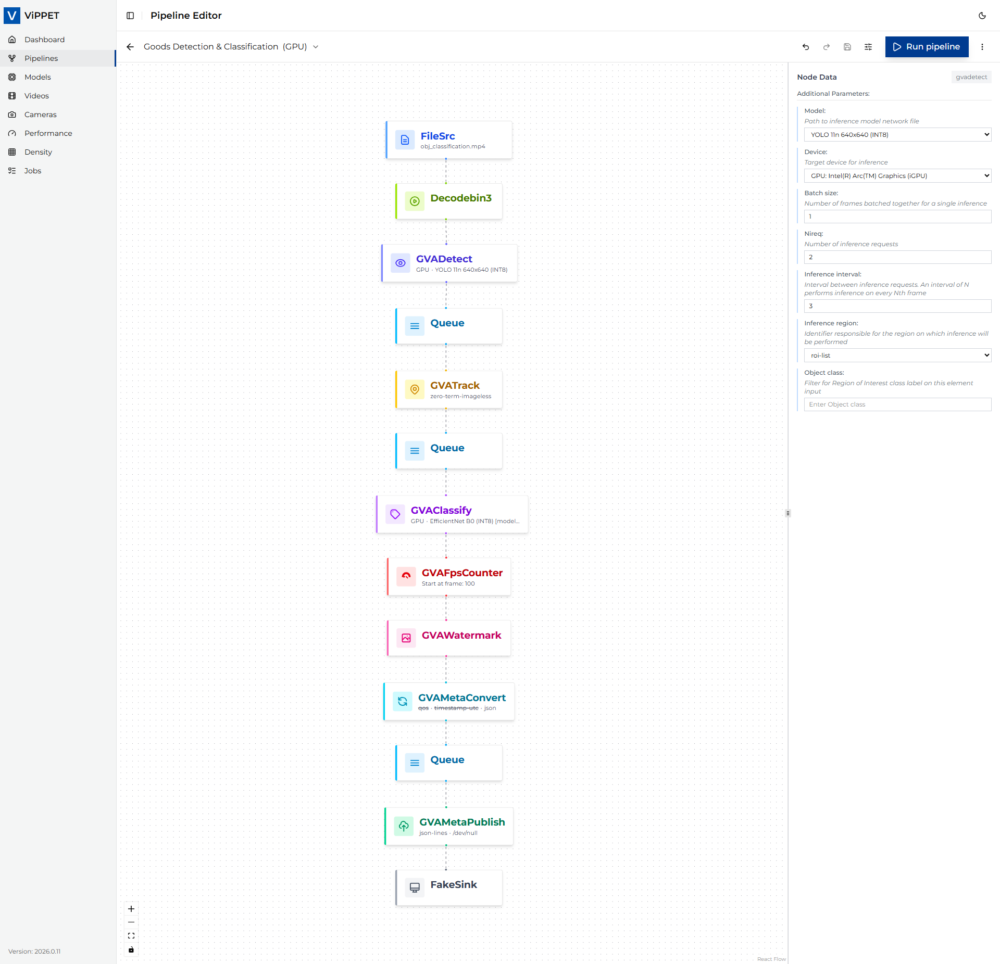
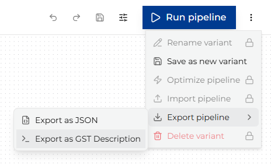

# Simple vs. Advanced View

Pipelines are presented in two modes: Simple View and Advanced View.

## Simple View

Simple View is designed for users who want to quickly set up and run pipelines without configuring every detail.
It provides a selected set of the most commonly used parameters and hides more advanced options.
This allows users to get started quickly and easily, while still providing enough flexibility for many use cases.

Simple View is the default mode when you open the Pipeline Builder.

## Advanced View

To switch to Advanced View, open *Pipeline Options* by clicking the button on the left side of the Run Pipeline button.

Advanced View provides access to all available parameters and options for configuring the pipeline.

### Export and import pipelines

Advanced View allows you to export and import pipelines. There are two export/import options:

- **As JSON** - Exports or imports the internal JSON representation of the pipeline. This option
  is useful for development because it preserves the pipeline layout.
- **As GST Description** - Exports or imports the pipeline as a `gst-launch` command line. This is
  useful for sharing pipelines with users who do not use ViPPET or for running pipelines outside
  ViPPET. A GST description string can also be used for
  [creating new pipelines](./pipeline-configuration.md#creating-pipelines-from-gst-description-string).

> **Note:** All initial variants of predefined pipelines are **read only**. This means you will
> not be able to import into these variants. Import will be available in advanced mode of user
> created pipelines or new variants of predefined pipelines.
